# Demo
# Tutorial: Creación de flujos de trabajo de automatización periódicos basados en programación con Azure Logic Apps

[Intrucciones](https://docs.microsoft.com/es-es/azure/logic-apps/tutorial-build-schedule-recurring-logic-app-workflow)

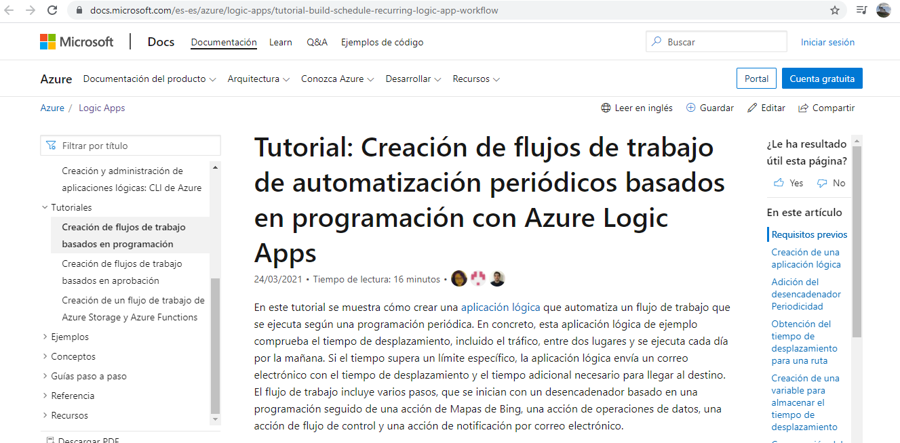

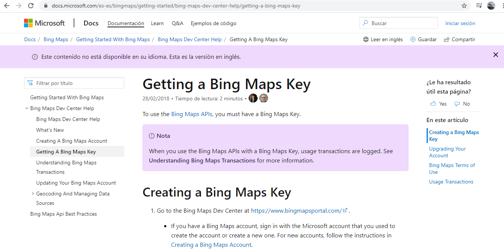

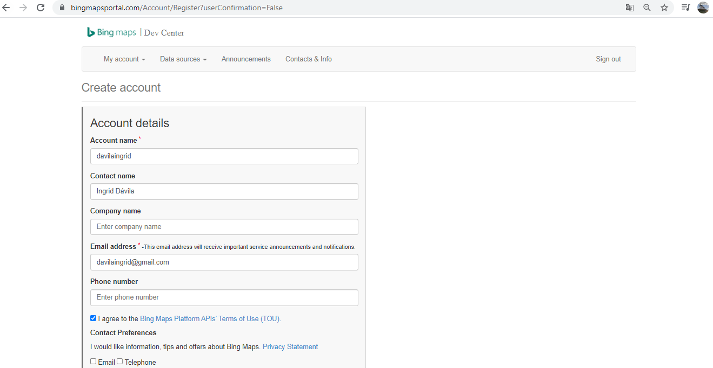

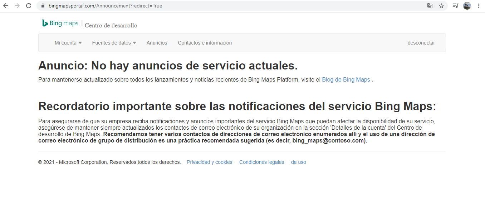

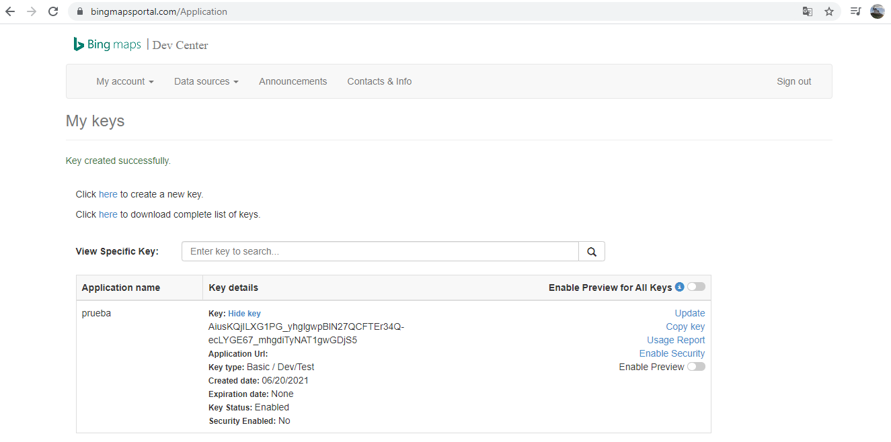

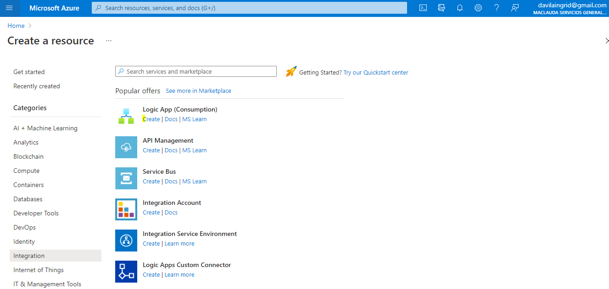

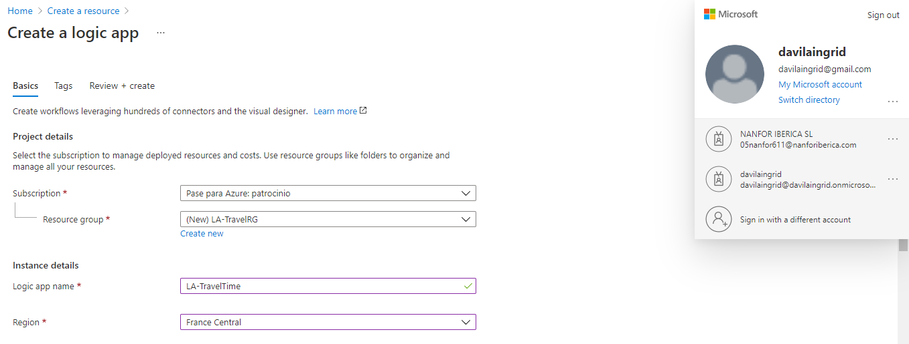

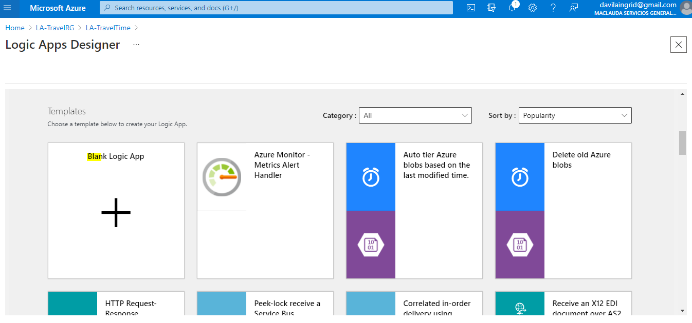

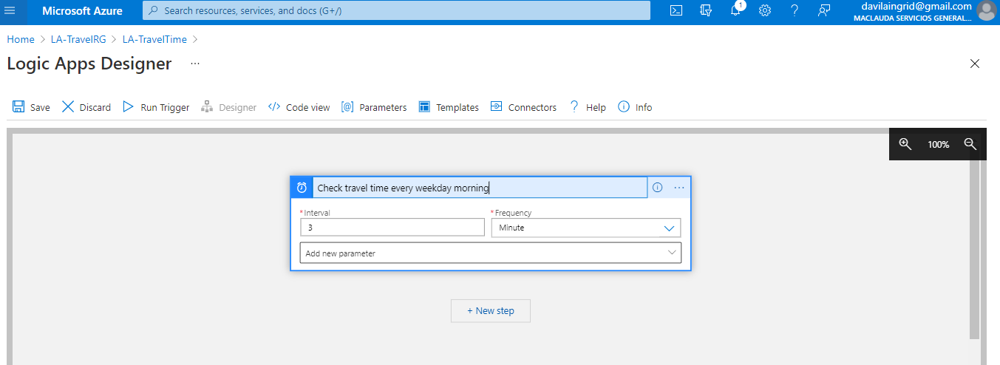

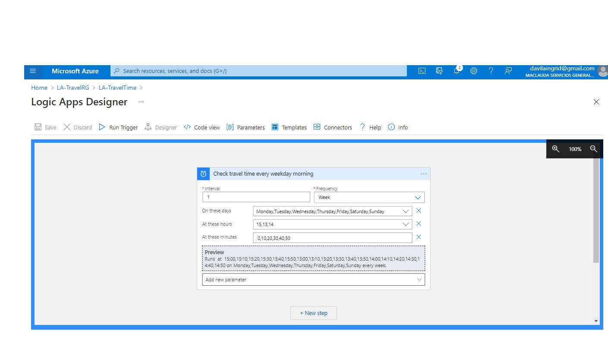

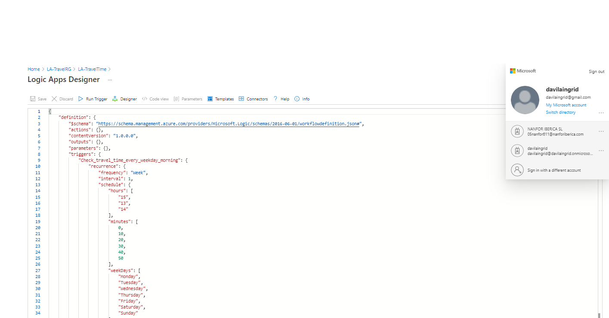

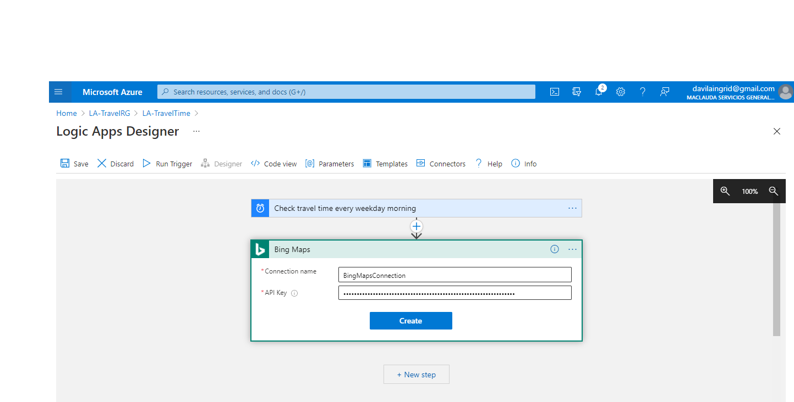

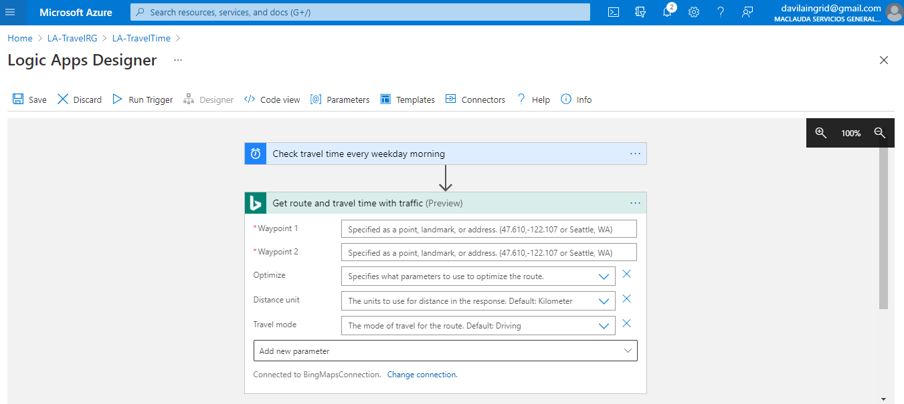

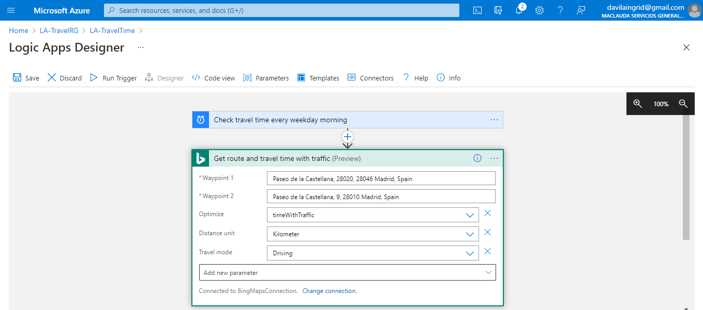

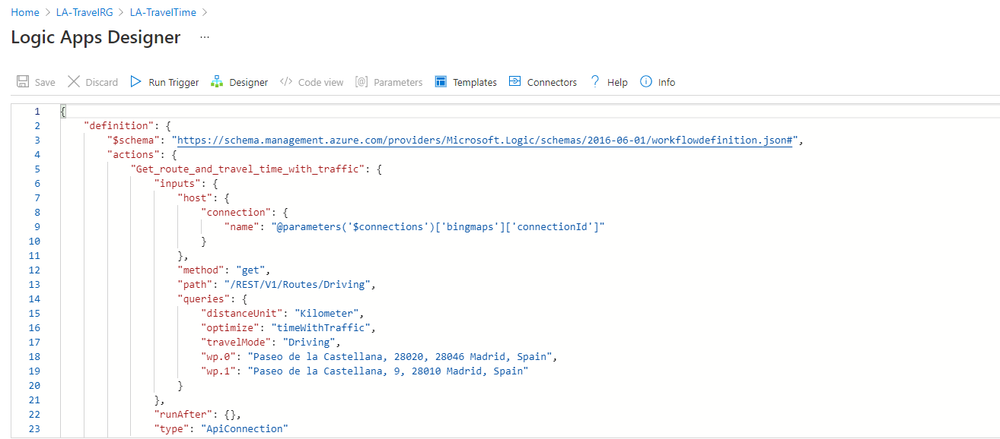

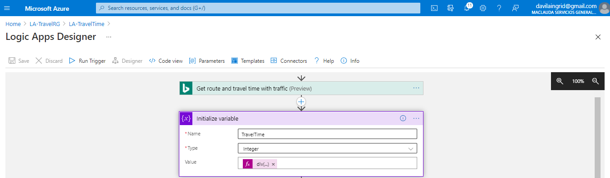

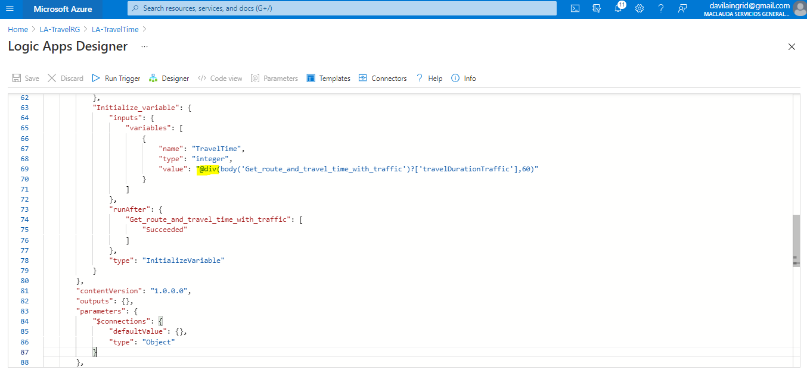

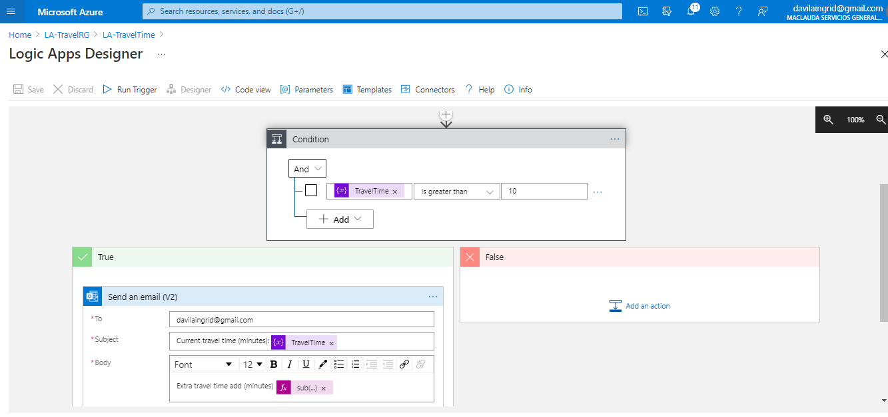

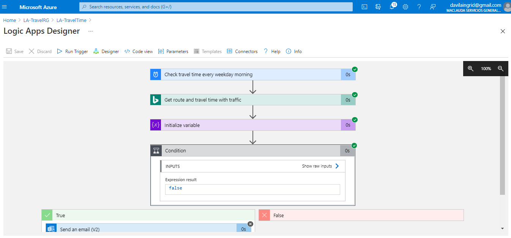