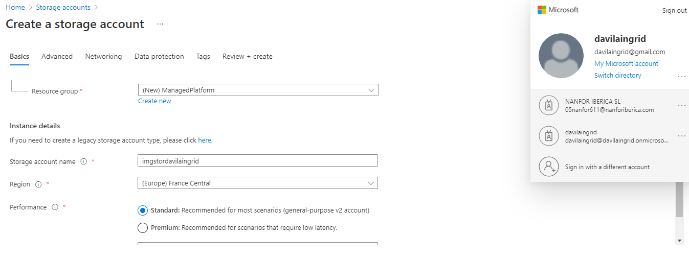
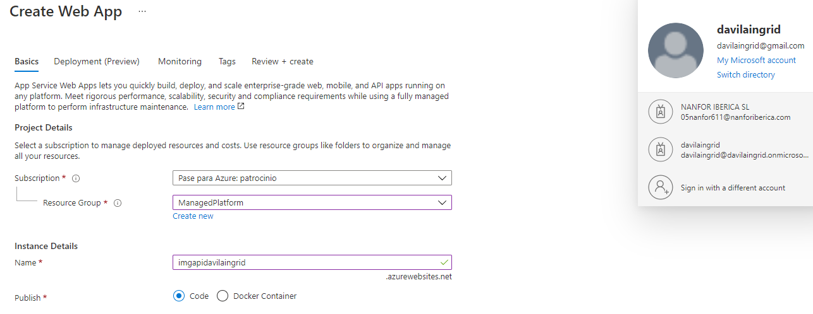
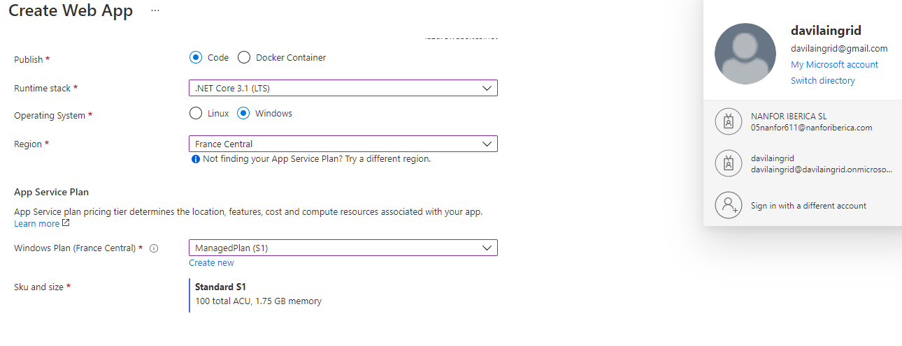
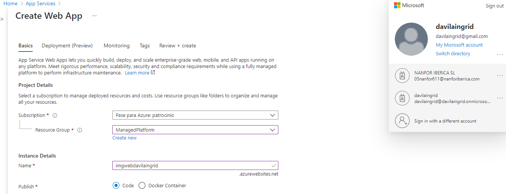
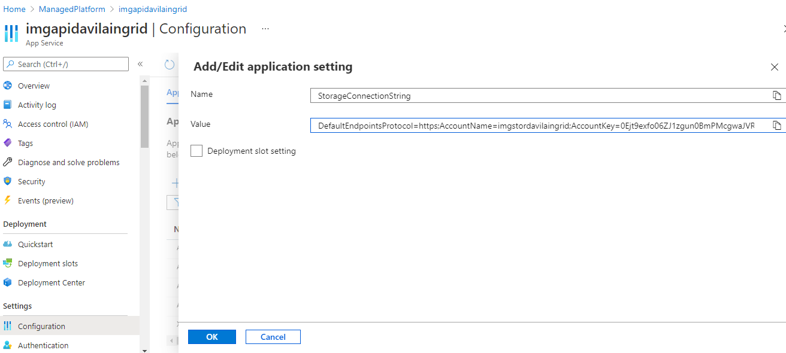
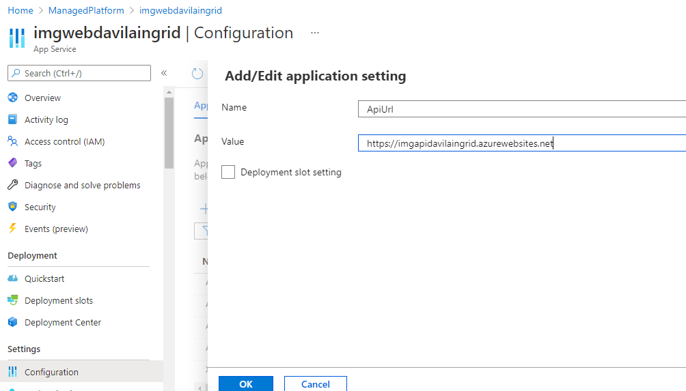

# Lab 01: Building a web application on Azure platform as a service offerings

## Architecture:


**Resultado de la creación de los App Service Web y Api: **

Creando una Storage account




Creando una Web App imgapidavilaingrid







Creando una Web App imgwebdavilaingrid




**Configuracion de la API Web**



**Configuración de la Web App**


**Código Az-CLI para desplegar el api rest**

```
az webapp deployment source config-zip --resource-group ManagedPlatform --src api.zip --name imgapibmvb01
```

**Código Az-CLI para desplegar el web app**

``` 
az webapp deployment source config-zip --resource-group ManagedPlatform --src web.zip --name imgwebbmvb0101
```


**Comprobación que las web api funcione correctamente **


**Comprobación que la web app funcione correctamente **


