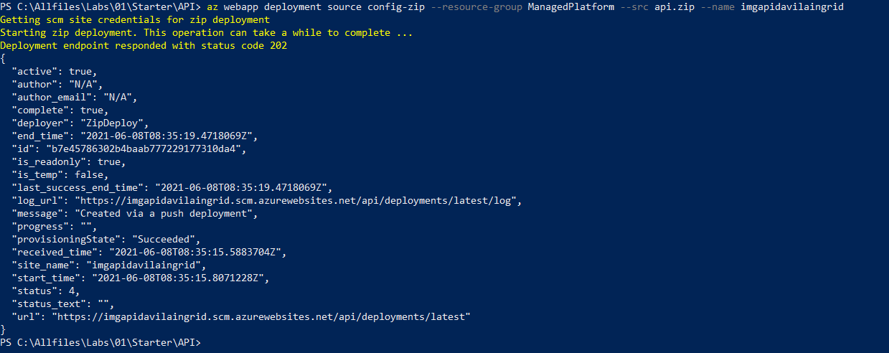
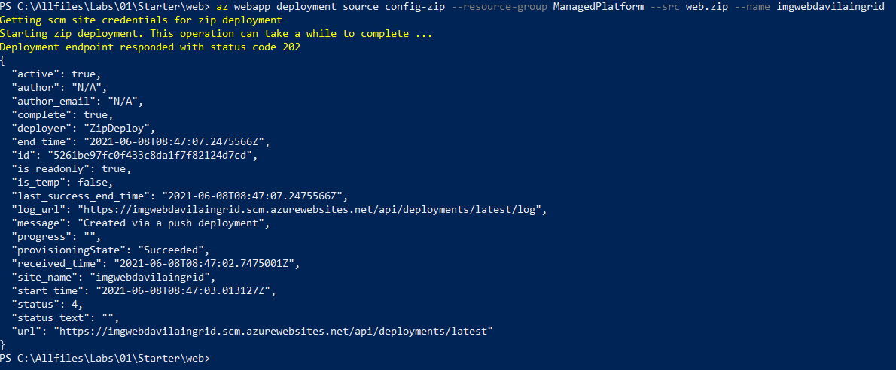
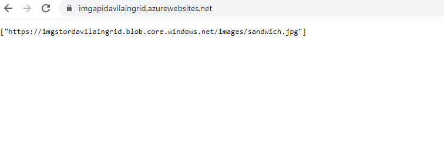
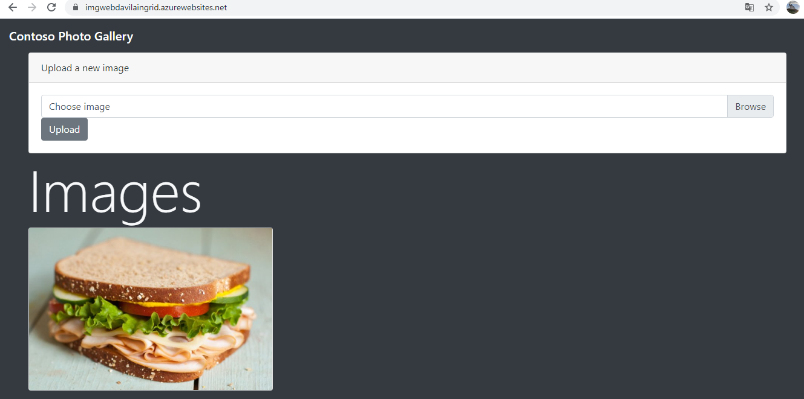
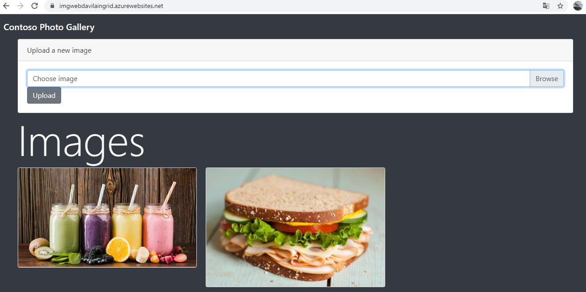

# Lab 01: Building a web application on Azure platform as a service offerings

## Architecture:

**Resultado de la creación de los App Service Web y Api: **

Creando una Storage account

Creando una Web App imgapidavilaingrid

Creando una Web App imgwebdavilaingrid

**Configuracion de la API Web**

**Configuración de la Web App**

**Código Az-CLI para desplegar el api rest**

**Código Az-CLI para desplegar el web app**

**Comprobación que las web api funcione correctamente **

**Comprobación que la web app funcione correctamente **

