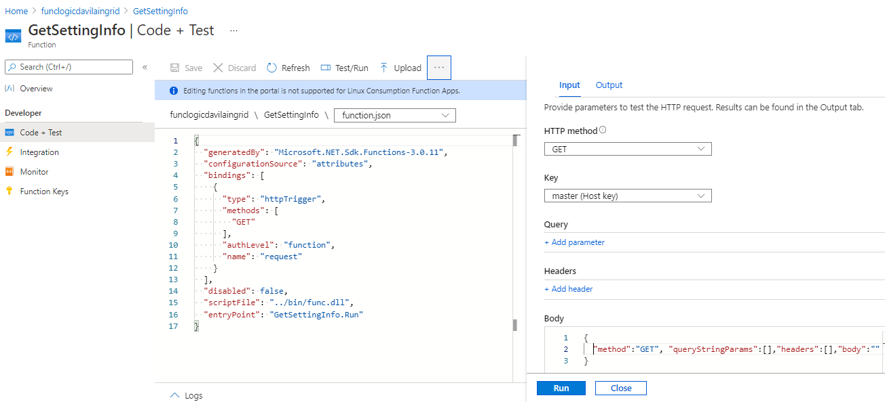

# Lab 02: Implementar la lógica de procesamiento de tareas mediante Azure Functions

## Escenario de laboratorio
Su empresa ha creado una herramienta de software de escritorio que analiza un archivo JavaScript Object Notation (JSON) local para sus ajustes de configuración. Durante su última reunión, su equipo decidió reducir la cantidad de archivos que se distribuyen con su aplicación sirviendo su configuración predeterminada desde una URL en lugar de un archivo local. Como nuevo desarrollador del equipo, se le asignó la tarea de evaluar las funciones de Microsoft Azure como una solución a este problema.

## Objetivos
Después de completar este lab, podrá:

- Cree una aplicación de Azure Functions en Azure Portal.

- Cree un proyecto de Azure Functions local con las herramientas principales de Azure Functions.

- Cree varias funciones mediante el uso de activadores incorporados e integraciones de entrada.
  Implemente un proyecto de Azure Functions local en Azure.

## Arquitectura

Creando un Storage Account:

Creando una Function App:

