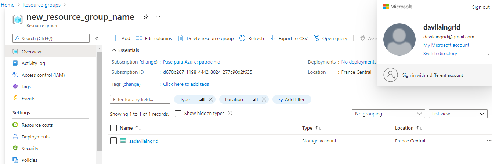
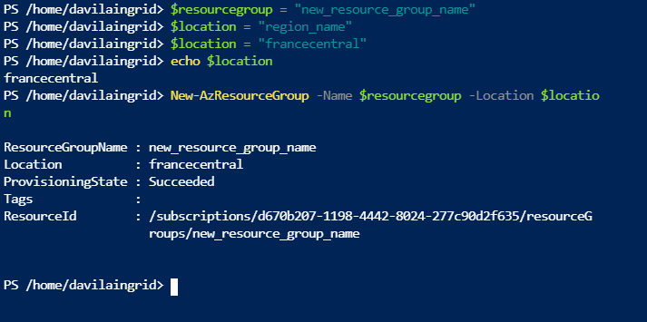

### Demo: Create a block blob storage account

The block blob storage account type lets you create block blobs with premium performance characteristics. This type of storage account is optimized for workloads with high transactions rates or that require very fast access times.

In this demo we'll cover how to create a block blob storage account by using the Azure portal, and in the cloud shell using both Azure PowerShell and Azure CLI.

#### Create account in the Azure portal

To create a block blob storage account in the Azure portal, follow these steps:

1. In the Azure portal, select **All services >** the **Storage** category > **Storage accounts**.

2. Under **Storage accounts**, select **Add**.

3. In the **Subscription** field, select the subscription in which to create the storage account.

4. In the **Resource group** field, select an existing resource group or select **Create new**, and enter a name for the new resource group.

5. In the **Storage account name** field, enter a name for the account. Note the following guidelines:

   - The name must be unique across Azure.
   - The name must be between three and 24 characters long.
   - The name can include only numbers and lowercase letters.

6. In the **Location** field, select a location for the storage account, or use the default location.

7. For the rest of the settings, configure the following:

   | Field            | Value                                                        |
   | ---------------- | ------------------------------------------------------------ |
   | **Performance**  | Select **Premium**.                                          |
   | **Account kind** | Select **BlockBlobStorage**.                                 |
   | **Replication**  | Leave the default setting of **Locally-redundant storage (LRS)**. |

8. Select **Review + create** to review the storage account settings.

9. Select **Create**.

#### Create account by using Azure Cloud Shell

1. Login to the [Azure Portal](https://portal.azure.com/) and open the Cloud Shell.

   - You can also login to the [Azure Cloud Shell](https://shell.azure.com/) directly.

2. Select **PowerShell** in the top-left section of the cloud shell.

3. Create a new resource group. Replace the values in quotations, and run the following commands:

   

   ```
   $resourcegroup = "new_resource_group_name"
   $location = "region_name"
   New-AzResourceGroup -Name $resourceGroup -Location $location
   ```

   

4. Create the block blob storage account. See Step 5 in the *Create account in the Azure portal* instructions above for the storage account name requirements. Replace the values in quotations, and run the following commands:

   

   ```
   $storageaccount = "new_storage_account_name"
   
   New-AzStorageAccount -ResourceGroupName $resourcegroup -Name $storageaccount `
   -Location $location -Kind "BlockBlobStorage" -SkuName "Premium_LRS"
   ```

   

   

   