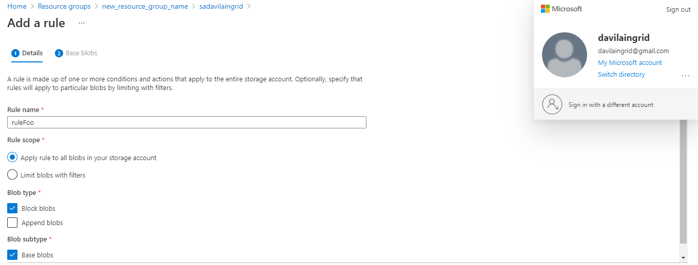
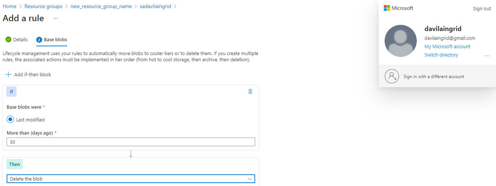
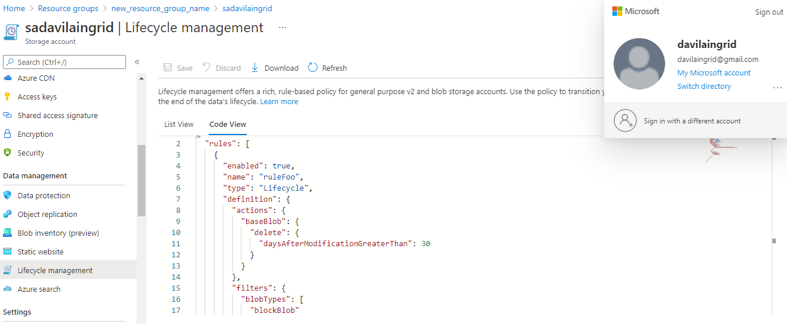

### Demo: Add a policy to Azure Blob storage

You can add, edit, or remove a policy by using any of the following methods:

- Azure portal
- Azure PowerShell
- Azure CLI
- REST APIs

We'll show the steps and some examples for the Portal and PowerShell.

#### Azure portal

There are two ways to add a policy through the Azure portal: Azure portal List view, and Azure portal Code view.

##### Azure portal List view

1. Sign in to the [Azure portal](https://portal.azure.com/).
2. Select **All resources** and then select your storage account.
3. Under **Blob Service**, select **Lifecycle management** to view or change your rules.
4. Select the **List view** tab.
5. Select **Add rule** and then fill out the **Action set** form fields. In the following example, blobs are moved to cool storage if they haven't been modified for 30 days.
6. Select **Filter set** to add an optional filter. Then, select Browse to specify a container and folder by which to filter.
7. Select **Review + add** to review the policy settings.
8. Select **Add** to add the new policy.

##### Azure portal Code view

1. Follow the first three steps above in the **List view** section.

2. Select the **Code view** tab. The following JSON is an example of a policy that can be pasted into the **Code view** tab.

   

   ```
   {
   "rules": [
       {
       "name": "ruleFoo",
       "enabled": true,
       "type": "Lifecycle",
       "definition": {
           "filters": {
           "blobTypes": [ "blockBlob" ],
           "prefixMatch": [ "container1/foo" ]
           },
           "actions": {
           "baseBlob": {
               "tierToCool": { "daysAfterModificationGreaterThan": 30 },
               "tierToArchive": { "daysAfterModificationGreaterThan": 90 },
               "delete": { "daysAfterModificationGreaterThan": 2555 }
           },
           "snapshot": {
               "delete": { "daysAfterCreationGreaterThan": 90 }
           }
           }
       }
       }
   ]
   }
   ```

   

3. Select **Save**.

#### PowerShell

The following PowerShell script can be used to add a policy to your storage account. The $rgname variable must be initialized with your resource group name. The $accountName variable must be initialized with your storage account name.


```
#Install the latest module if you are running this in a local PowerShell instance
Install-Module -Name Az -Repository PSGallery

#Initialize the following with your resource group and storage account names
$rgname = ""
$accountName = ""

#Create a new action object
$action = Add-AzStorageAccountManagementPolicyAction -BaseBlobAction Delete -daysAfterModificationGreaterThan 2555
$action = Add-AzStorageAccountManagementPolicyAction -InputObject $action -BaseBlobAction TierToArchive -daysAfterModificationGreaterThan 90
$action = Add-AzStorageAccountManagementPolicyAction -InputObject $action -BaseBlobAction TierToCool -daysAfterModificationGreaterThan 30
$action = Add-AzStorageAccountManagementPolicyAction -InputObject $action -SnapshotAction Delete -daysAfterCreationGreaterThan 90

# Create a new filter object
# PowerShell automatically sets BlobType as “blockblob” because it is the
# only available option currently
$filter = New-AzStorageAccountManagementPolicyFilter -PrefixMatch ab,cd

# Create a new rule object
# PowerShell automatically sets Type as “Lifecycle” because it is the
# only available option currently
$rule1 = New-AzStorageAccountManagementPolicyRule -Name Test -Action $action -Filter $filter

#Set the policy
$policy = Set-AzStorageAccountManagementPolicy -ResourceGroupName $rgname -StorageAccountName $accountName -Rule $rule1
```


#### REST APIs

You can also create and manage lifecycle policies by using REST APIs. For information on the operations see the [Management Policies](https://docs.microsoft.com/en-us/rest/api/storagerp/managementpolicies) reference page.










