### Demo: Using the Azure Blob storage client library for .NET v11

This demo uses the Azure Blob storage client library to show you how to perform the following actions on Azure Blob storage in a console app:

- Authenticate the client
- Create a container
- Upload blobs to a container
- List the blobs in a container
- Download blobs
- Delete a container

#### Setting up

Perform the following actions to prepare Azure, and your local environment, for the rest of the demo.

##### Create an Azure storage account and get credentials

1. Create a storage account.

   We need a storage account created to use in the application. You can either create it through the portal or use the following PowerShell script in the Cloud Shell. The script will prompt you for a region for the resources and then create resources needed for the demo.


   ```
   # Prompts for a region for the resources to be created
   # and generates a random name for the resources using
   # "az204" as the prefix for easy identification in the portal
   
   $myLocation = Read-Host -Prompt "Enter the region (i.e. westus): "
   $myResourceGroup = "az204-blobdemo-rg"
   $myStorageAcct = "az204blobdemo" + $(get-random -minimum 10000 -maximum 100000)
   
   # Create the resource group
   New-AzResourceGroup -Name $myResourceGroup -Location $myLocation
   
   # Create the storage account
   New-AzStorageAccount -ResourceGroupName $myResourceGroup -Name $myStorageAcct `
       -Location $myLocation -SkuName "Standard_LRS"
   
   
   Write-Host  "`nNote the following resource group, and storage account names, you will use them in the code examples below.
       Resource group: $myResourceGroup
       Storage account: $myStorageAcct"
   ```

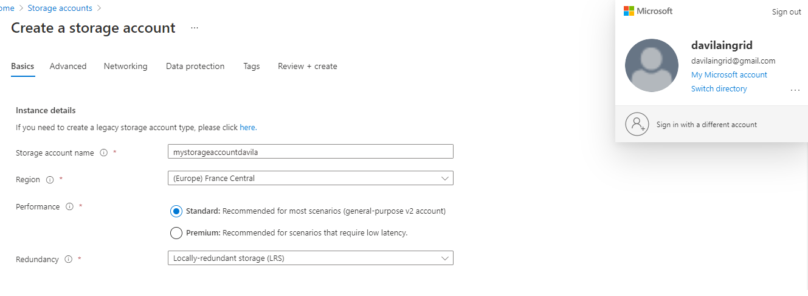


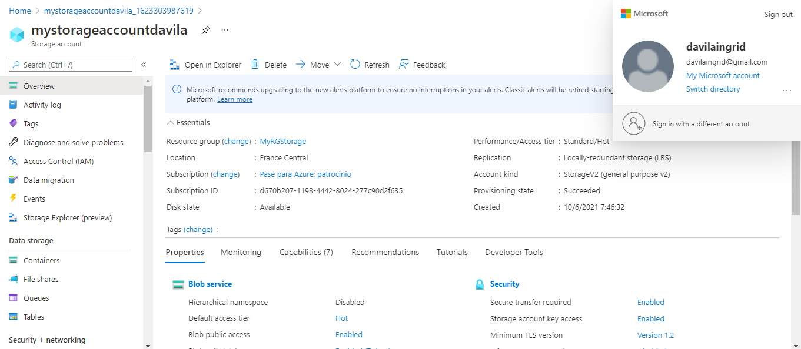

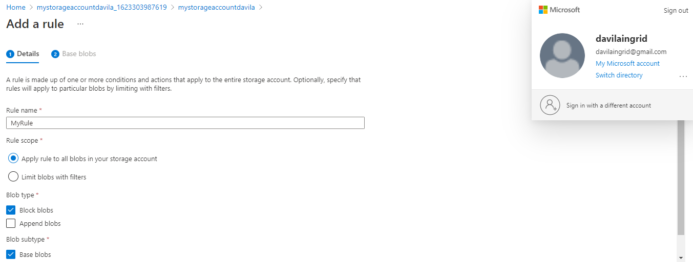

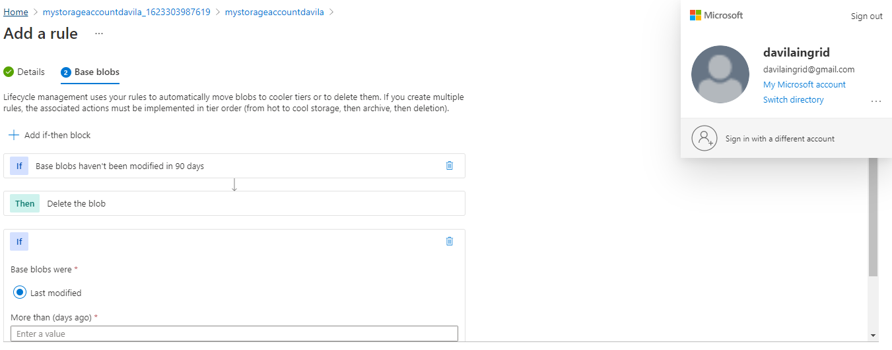

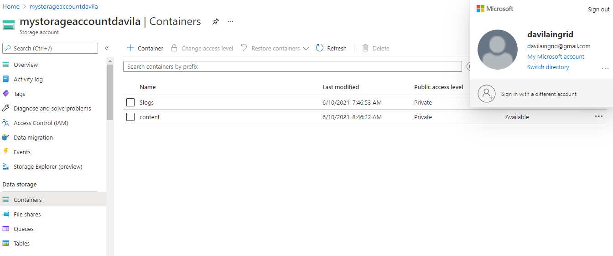


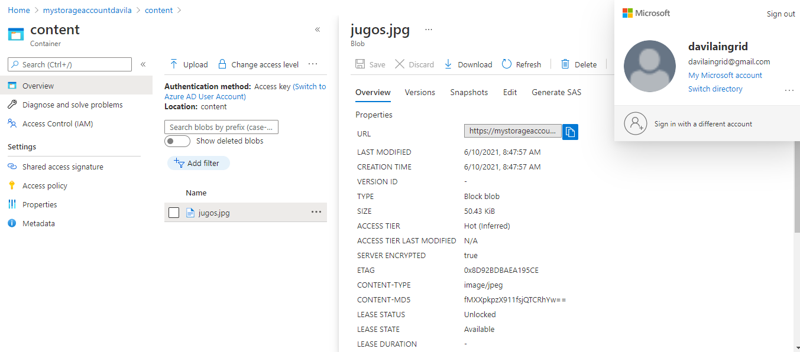

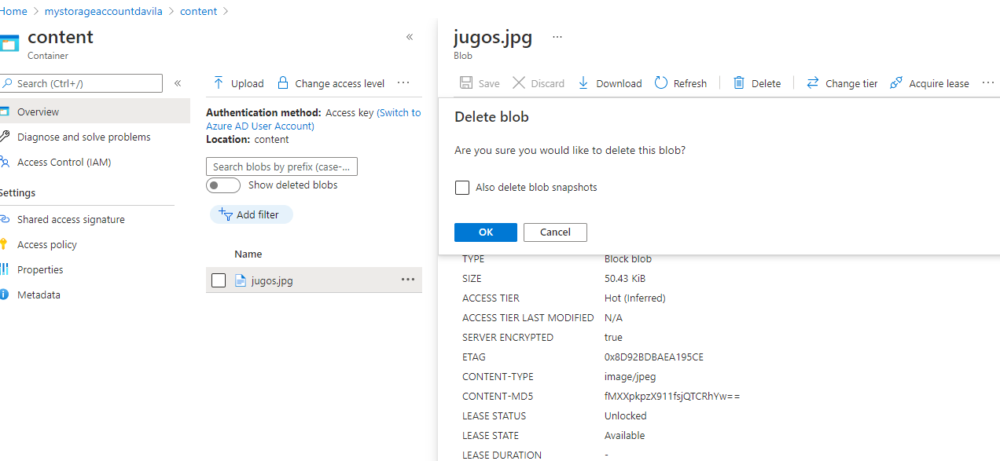

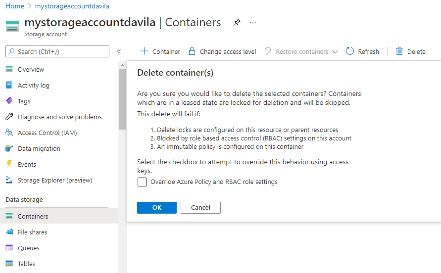

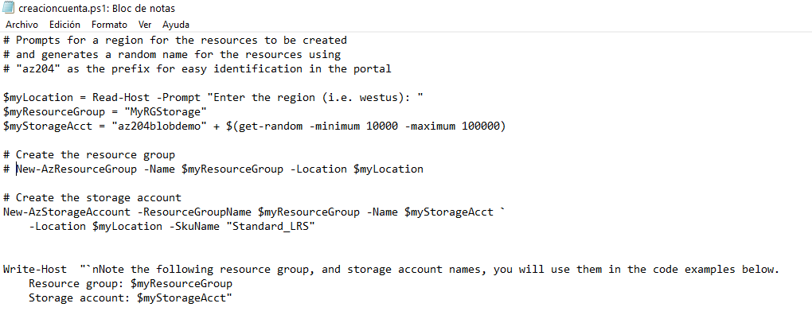


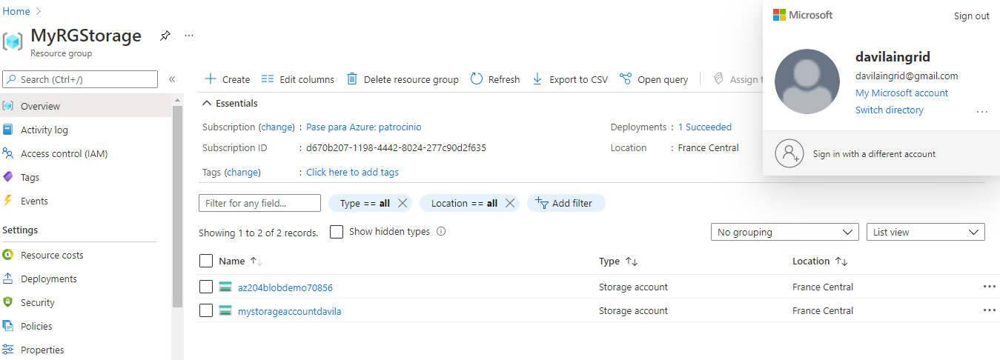

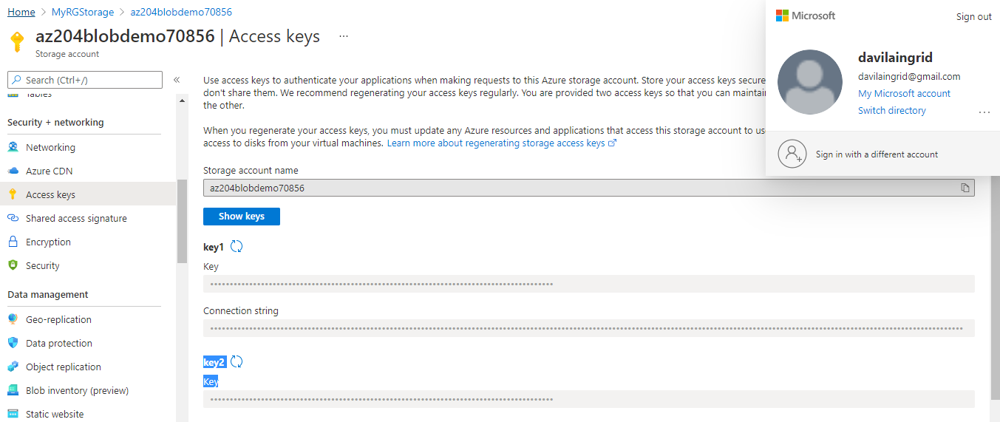


2. Get credentials for the storage account.

   - Navigate to the [Azure portal](https://portal.azure.com/).
   - Locate the storage account created in step 1.
   - In the **Settings** section of the storage account overview, select **Access keys**. Here, you can view your account access keys and the complete connection string for each key.
   - Find the **Connection string** value under **key1**, and select the **Copy** button to copy the connection string. You will add the connection string value to the code in the next section.
   - In the **Blob** section of the storage account overview, select **Containers**. Leave the windows open so you can view changes made to the storage as you progress through the demo.

##### Prepare the .NET project

In this section we'll create project named *az204-blobdemo* and install the Azure Blob Storage client library.

1. In a console window (such as cmd, PowerShell, or Bash), use the dotnet new command to create a new console app. This command creates a simple “Hello World” C# project with a single source file: *Program.cs*.

   

   ```
   dotnet new console -n az204-blobdemo
   ```


   

2. Use the following commands to switch to the newly created *az204-blobdemo* folder and build the app to verify that all is well.

   

   ```
   cd az204-blobdemo
   dotnet build
   ```


3. While still in the application directory, install the Azure Blob Storage client library for .NET package by using the dotnet add package command.

   

   ```
   dotnet add package Microsoft.Azure.Storage.Blob
   ```


   

   **Note:** Leave the console window open so you can use it to build and run the app later in the demo.

4. Open the *Program.cs* file in your editor, and replace the contents with the following code. The code uses the TryParse method to verify if the connection string can be parsed to create a CloudStorageAccount object.

   

   ```
   using System;
   using System.IO;
   using System.Threading.Tasks;
   using Microsoft.Azure.Storage;
   using Microsoft.Azure.Storage.Blob;
   
   namespace az204_blobdemo
   {
       class Program
       {
           public static void Main()
           {
               Console.WriteLine("Azure Blob Storage Demo\n");
   
               // Run the examples asynchronously, wait for the results before proceeding
               ProcessAsync().GetAwaiter().GetResult();
   
               Console.WriteLine("Press enter to exit the sample application.");
               Console.ReadLine();
   
           }
   
           private static async Task ProcessAsync()
           {
               // Copy the connection string from the portal in the variable below.
               string storageConnectionString = "PLACE CONNECTION STRING HERE";
   
               // Check whether the connection string can be parsed.
               CloudStorageAccount storageAccount;
               if (CloudStorageAccount.TryParse(storageConnectionString, out storageAccount))
               {
                   // Run the example code if the connection string is valid.
                   Console.WriteLine("Valid connection string.\r\n");
   
                   // EXAMPLE CODE STARTS BELOW HERE
   
   
   
                   //EXAMPLE CODE ENDS ABOVE HERE
               }
               else
               {
                   // Otherwise, let the user know that they need to define the environment variable.
                   Console.WriteLine(
                       "A valid connection string has not been defined in the storageConnectionString variable.");
                   Console.WriteLine("Press enter to exit the application.");
                   Console.ReadLine();
               }
           }
       }
   }
   ```

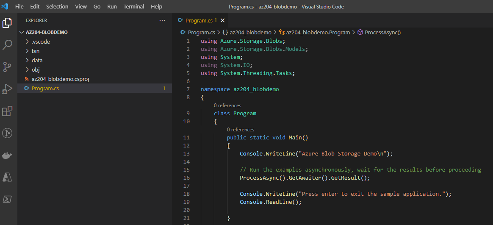


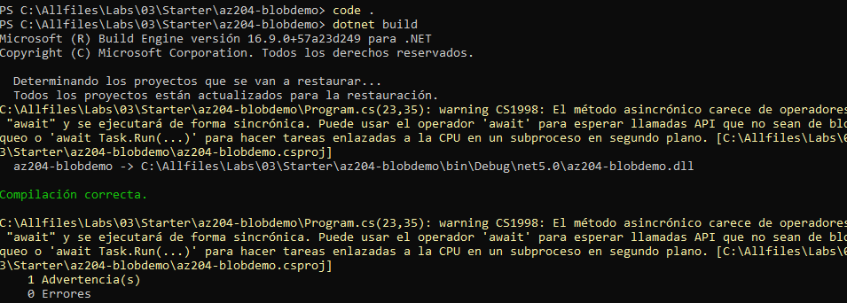


    

   ❗️ **Important:** The ProcessAsync method above contains directions on where to place the example code for the demo.

5. Set the storageConnectionString variable to the value you copied from the portal.

6. Build and run the application to verify your connection string is valid by using the dotnet build and dotnet run commands in your console window.

#### Building the full app

For each of the following sections below you'll find a brief description of the action being taken as well as the code snippet you'll add to the project. Each new snippet is appended to the one before it, and we'll build and run the console app at the end.

For each example below:

1. Copy the code and append it to the previous snippet in the example code section of the *Program.cs* file.

##### Create a container

To create the container, first create an instance of the CloudBlobClient object, which points to Blob storage in your storage account. Next, create an instance of the CloudBlobContainer object, then create the container. The code below calls the CreateAsync method to create the container. A GUID value is appended to the container name to ensure that it is unique. In a production environment, it's often preferable to use the CreateIfNotExistsAsync method to create a container only if it does not already exist.


```
// Create a container called 'quickstartblobs' and
// append a GUID value to it to make the name unique.
CloudBlobContainer cloudBlobContainer =
    cloudBlobClient.GetContainerReference("demoblobs" +
        Guid.NewGuid().ToString());
await cloudBlobContainer.CreateAsync();

Console.WriteLine("A container has been created, note the " +
    "'Public access level' in the portal.");
Console.WriteLine("Press 'Enter' to continue.");
Console.ReadLine();
```


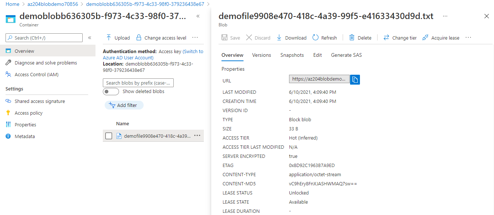


##### Upload blobs to a container

The following code snippet gets a reference to a CloudBlockBlob object by calling the GetBlockBlobReference method on the container created in the previous section. It then uploads the selected local file to the blob by calling the UploadFromFileAsync method. This method creates the blob if it doesn't already exist, and overwrites it if it does.


```
// Create a file in your local MyDocuments folder to upload to a blob.
string localPath = Environment.GetFolderPath(Environment.SpecialFolder.MyDocuments);
string localFileName = "BlobDemo_" + Guid.NewGuid().ToString() + ".txt";
string sourceFile = Path.Combine(localPath, localFileName);
// Write text to the file.
File.WriteAllText(sourceFile, "Hello, World!");

Console.WriteLine("\r\nTemp file = {0}", sourceFile);
Console.WriteLine("Uploading to Blob storage as blob '{0}'", localFileName);

// Get a reference to the blob address, then upload the file to the blob.
// Use the value of localFileName for the blob name.
CloudBlockBlob cloudBlockBlob = cloudBlobContainer.GetBlockBlobReference(localFileName);
await cloudBlockBlob.UploadFromFileAsync(sourceFile);

Console.WriteLine("\r\nVerify the creation of the blob and upload in the portal.");
Console.WriteLine("Press 'Enter' to continue.");
Console.ReadLine();
```


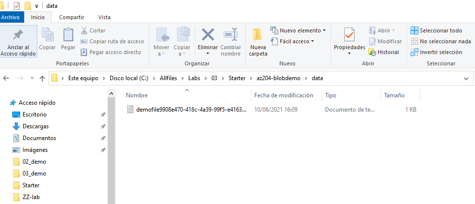


##### List the blobs in a container

List the blobs in the container by using the ListBlobsSegmentedAsync method. In this case, only one blob has been added to the container, so the listing operation returns just that one blob. The code below shows the best practice of using a continuation token to ensure you've retrieved the full list in one call (by default, more than 5000).


```
// List the blobs in the container.
Console.WriteLine("List blobs in container.");
BlobContinuationToken blobContinuationToken = null;
do
{
    var results = await cloudBlobContainer.ListBlobsSegmentedAsync(null, blobContinuationToken);
    // Get the value of the continuation token returned by the listing call.
    blobContinuationToken = results.ContinuationToken;
    foreach (IListBlobItem item in results.Results)
    {
        Console.WriteLine(item.Uri);
    }
} while (blobContinuationToken != null); // Loop while the continuation token is not null.

Console.WriteLine("\r\nCompare the list in the console to the portal.");
Console.WriteLine("Press 'Enter' to continue.");
Console.ReadLine();
```


##### Download blobs

Download the blob created previously to your local file system by using the DownloadToFileAsync method. The example code adds a suffix of “_DOWNLOADED” to the blob name so that you can see both files in local file system.


```
// Download the blob to a local file, using the reference created earlier.
// Append the string "_DOWNLOADED" before the .txt extension so that you
// can see both files in MyDocuments.
string destinationFile = sourceFile.Replace(".txt", "_DOWNLOADED.txt");
Console.WriteLine("Downloading blob to {0}", destinationFile);
await cloudBlockBlob.DownloadToFileAsync(destinationFile, FileMode.Create);

Console.WriteLine("\r\nLocate the local file to verify it was downloaded.");
Console.WriteLine("Press 'Enter' to continue.");
Console.ReadLine();
```


##### Delete a container

The following code cleans up the resources the app created by deleting the entire container using CloudBlobContainer.DeleteAsync. You can also delete the local files if you like.


```
// Clean up the resources created by the app
Console.WriteLine("Press the 'Enter' key to delete the example files " +
    "and example container.");
Console.ReadLine();
// Clean up resources. This includes the container and the two temp files.
Console.WriteLine("Deleting the container");
if (cloudBlobContainer != null)
{
    await cloudBlobContainer.DeleteIfExistsAsync();
}
Console.WriteLine("Deleting the source, and downloaded files\r\n");
File.Delete(sourceFile);
File.Delete(destinationFile);
```

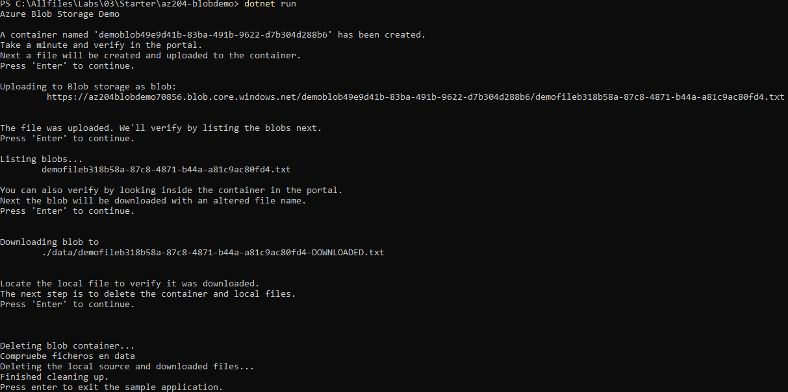


#### Run the code

Now that the app is complete it's time to build and run it. Ensure you are in your application directory and run the following commands:


```
dotnet build
dotnet run
```


There are many prompts in the app to allow you to take the time to see what's happening in the portal after each step.

##### Clean up other resources

The app deleted the resources it created. If you no longer need the resource group or storage account created earlier be sure to delete those through the portal.