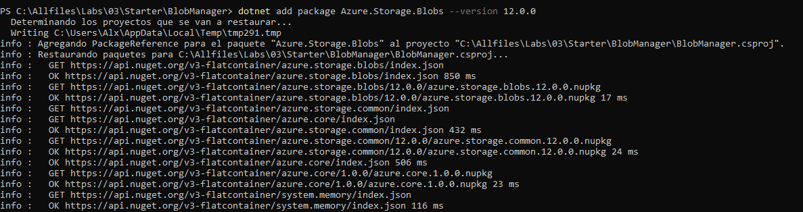

# Lab 03: Retrieving Azure Storage resources and metadata by using the Azure Storage SDK for .NET

## Escenario de laboratorio
You're preparing to host a web application in Microsoft Azure that uses a combination of raster and vector graphics. As a development group, your team has decided to store any multimedia content in Azure Storage and manage it in an automated fashion by using C# code in Microsoft .NET. Before you begin this significant milestone, you have decided to take some time to learn the newest version of the .NET SDK that's used to access Storage by creating a simple application to manage and enumerate blobs and containers.

## Objetivos
After you complete this lab, you will be able to:

Create containers and upload blobs by using the Azure portal.

Enumerate blobs and containers by using the Microsoft Azure Storage SDK for .NET.

Creando un Storage Account:

Desarrollo:

