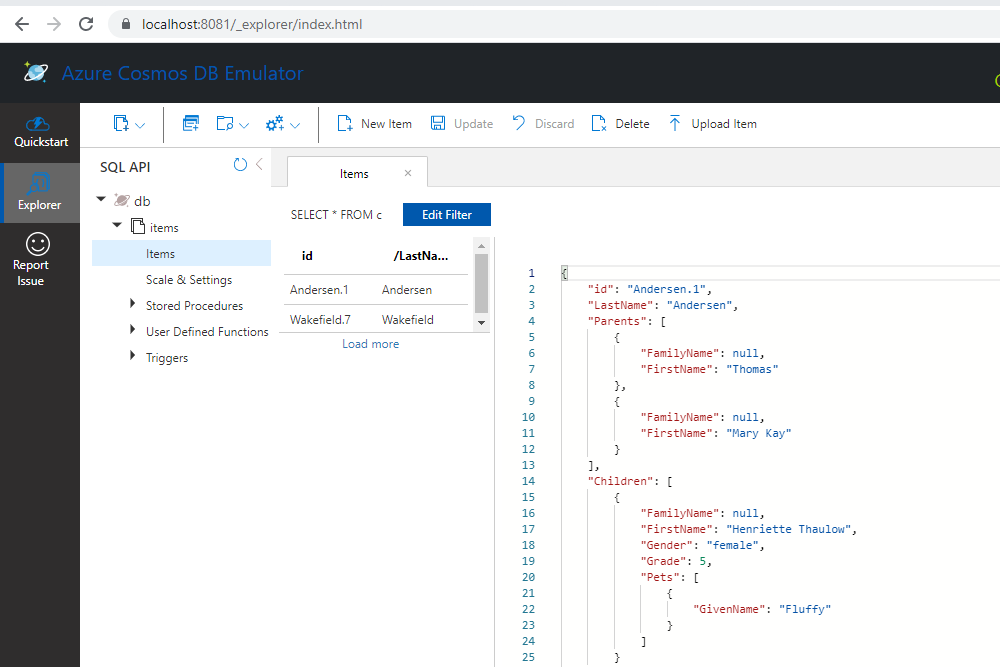
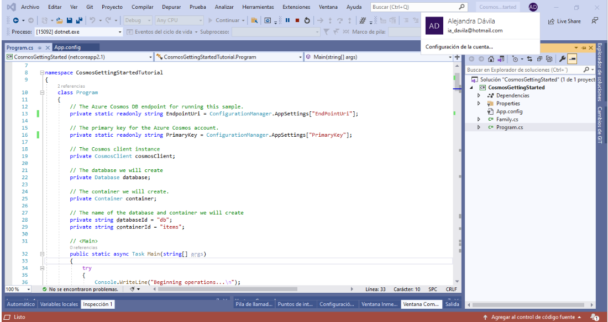

### Demo: Working with Azure Cosmos DB by using .NET

In this demo you'll create a console app to perform the following operations in Azure Cosmos DB:

- Connect to an Azure Cosmos DB account
- Create a database
- Create a container

#### Prerequisites

This demo is performed in the Visual Studio code on the virtual machine.

##### Retrieve Azure Cosmos DB account keys

1. Login to the Azure portal. [https://portal.azure.com](https://portal.azure.com/)
2. Navigate to the Azure Comsos DB account you created in the *Create Azure Cosmos DB resources by using the Azure Portal* demo.
3. Select **Keys** in the left navigation panel. Leave the browser open so you can copy the needed information later in this demo.

##### Set up the console application

1. Open a PowerShell terminal.

2. Create a folder for the project and change in to the folder.

   

   ```
   md az204-cosmosdemo
   
   cd az204-cosmosdemo
   ```

   

3. Create the .NET console app.

   

   ```
   dotnet new console
   ```

   

4. Open Visual Studio Code and open the *az204-cosmosdemo* folder.

   

   ```
   code .
   ```

   

5. Open *Program.cs*

#### Build the console app

##### Add packages and using statements

1. Add the Microsoft.Azure.Cosmos package to the project in a terminal in VS Code.

   dotnet add package Microsoft.Azure.Cosmos

2. Add using statements to include Microsoft.Azure.Cosmos and to enable async operations.

   

   ```
   using System.Threading.Tasks;
   using Microsoft.Azure.Cosmos;
   ```

   

3. Change the Main method to enable async.

   

   ```
   public static async Task Main(string[] args)
   ```

   

4. Delete the existing code from the Main method.

##### Add code to connect to an Azure Cosmos DB account

1. Add these constants and variables into your Program class.

   

   ```
   public class Program
   {
       // The Azure Cosmos DB endpoint for running this sample.
       private static readonly string EndpointUri = "<your endpoint here>";
       // The primary key for the Azure Cosmos account.
       private static readonly string PrimaryKey = "<your primary key>";
   
       // The Cosmos client instance
       private CosmosClient cosmosClient;
   
       // The database we will create
       private Database database;
   
       // The container we will create.
       private Container container;
   
       // The name of the database and container we will create
       private string databaseId = "az204Database";
       private string containerId = "az204Container";
   }
   ```

   

2. In *Program.cs*, replace <your endpoint URL> with the value of **URI**. Replace <your primary key> with the value of **PRIMARY KEY**. You get these values from the browser window you left open above.

3. Below the **Main** method, add a new asynchronous task called **GetStartedDemoAsync**, which instantiates our new CosmosClient.

   

   ```
   public async Task CosmosDemoAsync()
   {
       // Create a new instance of the Cosmos Client
       this.cosmosClient = new CosmosClient(EndpointUri, PrimaryKey);
   }
   ```

   

4. Add the following code to the **Main** method to run the **CosmosDemoAsync** asynchronous task. The **Main** method catches exceptions and writes them to the console.

   

   ```
   public static async Task Main(string[] args)
   {
       try
       {
           Console.WriteLine("Beginning operations...\n");
           Program p = new Program();
           await p.CosmosDemoAsync();
   
       }
       catch (CosmosException de)
       {
           Exception baseException = de.GetBaseException();
           Console.WriteLine("{0} error occurred: {1}", de.StatusCode, de);
       }
       catch (Exception e)
       {
           Console.WriteLine("Error: {0}", e);
       }
       finally
       {
           Console.WriteLine("End of demo, press any key to exit.");
           Console.ReadKey();
       }
   }
   ```

   

5. Save your work and, in a terminal in VS Code, run the dotnet run command.

   The console displays the message: **End of demo, press any key to exit.** This message confirms that your application made a connection to Azure Cosmos DB.

#### Create a database

1. Copy and paste the CreateDatabaseAsync method below your CosmosDemoAsync method. CreateDatabaseAsync creates a new database with ID az204Database if it doesn't already exist, that has the ID specified from the databaseId field.

   

   ```
   private async Task CreateDatabaseAsync()
   {
       // Create a new database
       this.database = await this.cosmosClient.CreateDatabaseIfNotExistsAsync(databaseId);
       Console.WriteLine("Created Database: {0}\n", this.database.Id);
   }
   ```

   

2. Copy and paste the code below where you instantiate the CosmosClient to call the **CreateDatabaseAsync** method you just added.

   

   ```
   // Runs the CreateDatabaseAsync method
   await this.CreateDatabaseAsync();
   ```

   

3. Save your work and, in a terminal in VS Code, run the dotnet run command. The console displays the message: **Created Database: az204Database**

#### Create a container

1. Copy and paste the CreateContainerAsync method below your CreateDatabaseAsync method.

   

   ```
   private async Task CreateContainerAsync()
   {
       // Create a new container
       this.container = await this.database.CreateContainerIfNotExistsAsync(containerId, "/LastName");
       Console.WriteLine("Created Container: {0}\n", this.container.Id);
   }
   ```

   

2. Copy and paste the code below where you instantiated the CosmosClient to call the **CreateContainer** method you just added.

   

   ```
   // Run the CreateContainerAsync method
   await this.CreateContainerAsync();
   ```

   

3. Save your work and, in a terminal in VS Code, run the dotnet run command. The console displays the message: **Created Container: az204Container**

   ✔️ **Note:** You can verify the results by returning to your browser and selecting **Browse** in the **Containers** section in the left navigation. You may need to select **Refresh**.

#### Wrapping up

You can now safely delete the *az204-cosmos-rg* resource group from your account.







