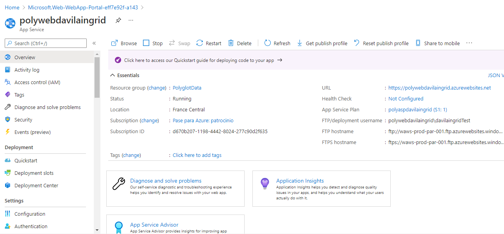
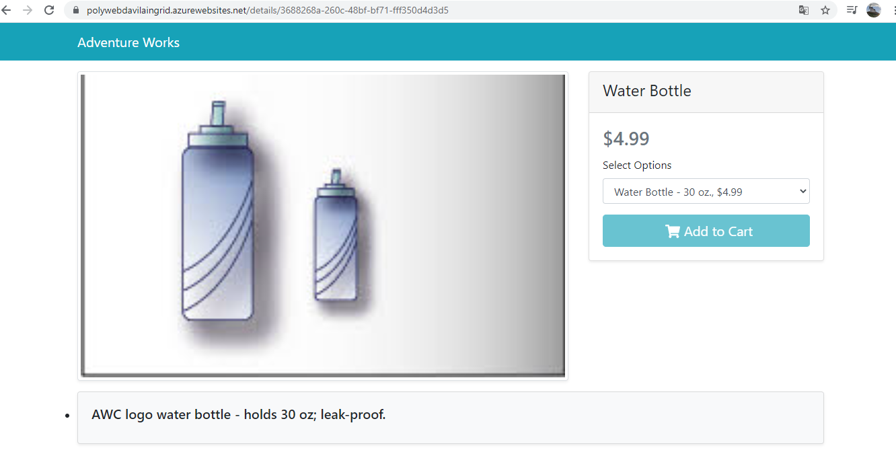

# Lab 04: Constructing a polyglot data solution

## Escenario de laboratorio
You have been assigned the task of updating your company’s existing retail web application to use more than one data service in Microsoft Azure. Your company’s goal is to take advantage of the best data service for each application component. After conducting thorough research, you decide to migrate your invent

## Objetivos
After you complete this lab, you will be able to:

Create instances of various database services by using the Azure portal.

Write C# code to connect to SQL Database.

Write C# code to connect to Azure Cosmos DB.

Creando un SQL Database Server :

Desarrollo:

