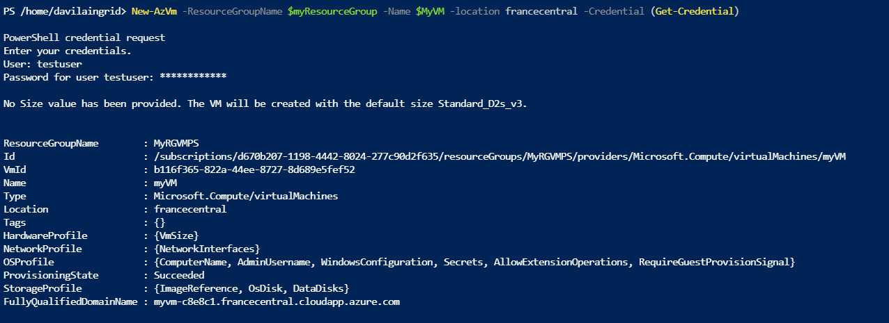
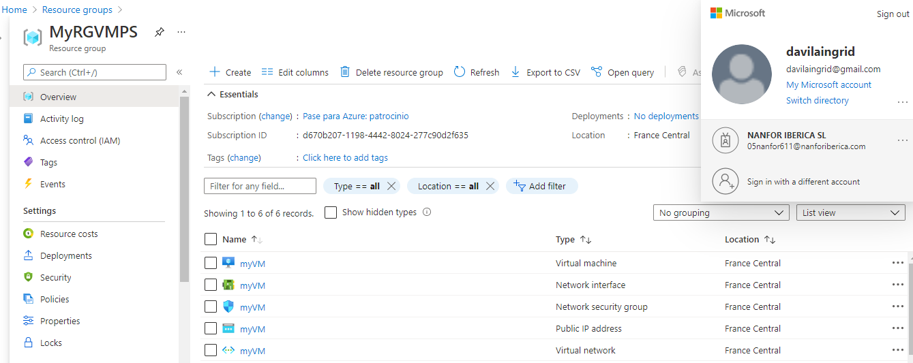
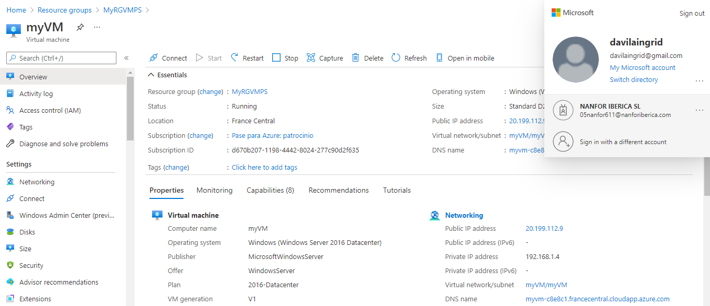
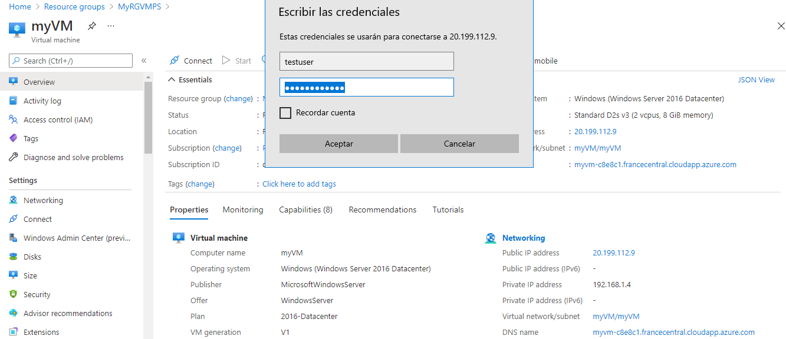
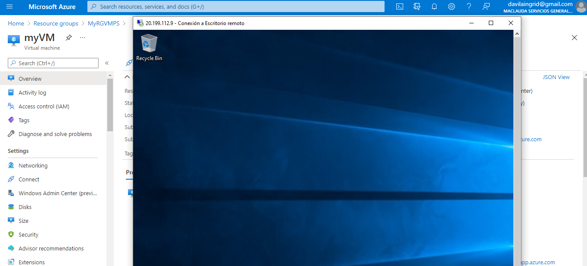

### Demo: Creating an Azure VM by using the Azure portal

In this Demo, you will learn how to create and access a Windows virtual machine in the portal.

#### Create the virtual machine

1. Choose **Create a resource** in the upper left-hand corner of the Azure portal.
2. In the **New** page, under **Popular**, select **Windows Server 2016 Datacenter**, then choose **Create**.
3. In the **Basics** tab, under **Project details**, make sure the correct subscription is selected and then choose to **Create new** resource group. Type the *myResourceGroup* for the name. Creating a new resource group will make it easier to clean up at the end of the demo.
4. Under **Instance details**, type *myVM* for the **Virtual machine name** and choose a **Location**. Leave the other defaults.
5. Under **Administrator account**, provide a username, such as *azureuser* and a password. The password must be at least 12 characters long and meet the defined complexity requirements.
6. Under **Inbound port rules**, choose **Allow selected ports** and then select **RDP (3389)** and **HTTP** from the drop-down.
7. Move to the **Management** tab, and under **Monitoring** turn **Off** Boot Diagnostics. This will eliminate validation errors.
8. Leave the remaining defaults and then select the **Review + create** button at the bottom of the page.

#### Connect to virtual machine

Create a remote desktop connection to the virtual machine. These directions tell you how to connect to your VM from a Windows computer. On a Mac, you need to install an RDP client from the Mac App Store.

1. Select the **Connect** button on the virtual machine properties page.
2. In the **Connect to virtual machine** page, keep the default options to connect by DNS name over port 3389 and click **Download RDP file**.
3. Open the downloaded RDP file and select **Connect** when prompted.
4. In the **Windows Security** window, select **More choices** and then **Use a different account**. Type the username as **localhost** \username, enter password you created for the virtual machine, and then select **OK**.
5. You may receive a certificate warning during the sign-in process. Select **Yes** or **Continue** to create the connection.

#### Clean up resources

When no longer needed, you can delete the resource group, virtual machine, and all related resources. To do so, select the resource group for the virtual machine, select **Delete**, then confirm the name of the resource group to delete.

