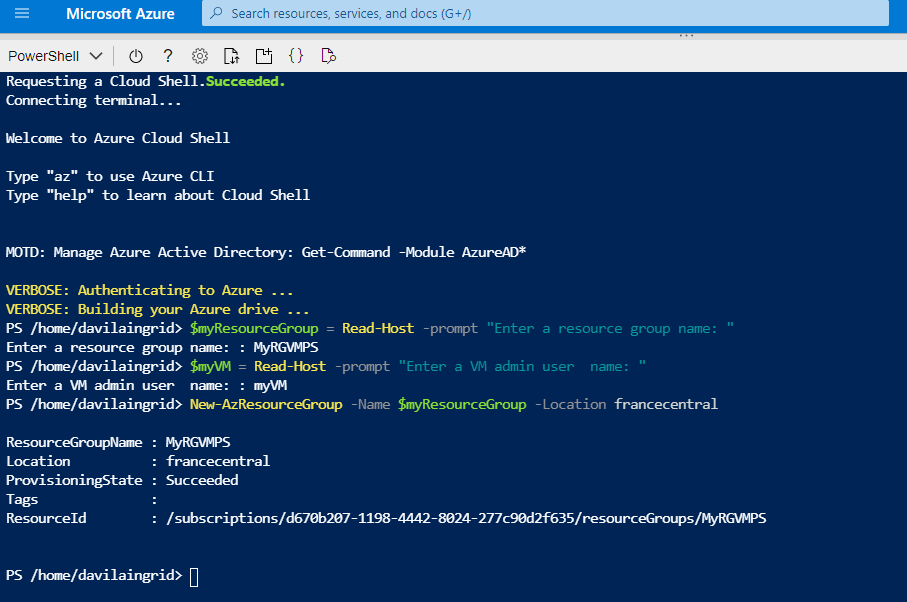

### Demo: Creating an Azure VM by using PowerShell

In this Demo, you will learn how to create a virtual machine by using PowerShell.

#### Create the virtual machine

1. Launch the [Cloud Shell](https://shell.azure.com/), or open a local PowerShell window.

   - If running locally use the Connect-AzAccount command to connect to your account.

2. Run this code:

   ```powershell
   $myResourceGroup = Read-Host -prompt "Enter a resource group name: "
   $myLocation = Read-Host -prompt "Enter a location (ie. WestUS): "
   $myVM = Read-Host -prompt "Enter a VM name: "
   $vmAdmin = Read-Host -prompt "Enter a VM admin user name: "
   
   # The password must meet the length and complexity requirements.
   $vmPassword = Read-Host -prompt "Enter the admin password: "
   
   # create a resource group
   New-AzResourceGroup -Name $myResourceGroup -Location $myLocation
   
   # Create the virtual machine. When prompted, provide a username
   # and password to be used as the logon credentials for the VM.
   
   New-AzVm `
       -ResourceGroupName $myResourceGroup `
       -Name $myVM `
       -Location $myLocation `
       -adminUsername $vmAdmin `
       -adminPassword $vmPassword
   ```

   It will take a few minutes for the VM to be created.

#### Verify the machine creation in the portal

1. Access the portal and view your virtual machines.
2. Verify the new VM was created.
3. Connect to the new VM:
   - Select the VM you just created.
   - Select **Connect**.
   - Launch Remote Desktop connect to the VM with the IP address and port information displayed.

#### Clean up resources

When no longer needed, you can delete the resource group, virtual machine, and all related resources. Replace <myResourceGroup> with the name you used earlier, or you can delete it through the portal.

```
Remove-AzResourceGroup -Name "<myResourceGroup>"
```




