### Demo: Retrieve and deploy existing Docker image locally

In this demo, you will learn to perform the following actions:

- Retrieve an image with a sample app from Docker Hub and run it.
- Examine the local state of Docker to help understand the elements that are deployed.
- Remove the container and image from your computer.

#### Prerequisites

- You'll need a local installation of Docker
  - https://www.docker.com/products/docker-desktop

#### Retrieve and run sample app from Docker Hub

1. Open a command prompt on your local computer

2. Retrieve the **ASP.NET Sample** app image from the Docker Hub registry. This image contains a sample web app developed by Microsoft.

   

   ```
   docker pull mcr.microsoft.com/dotnet/core/samples:aspnetapp
   ```

   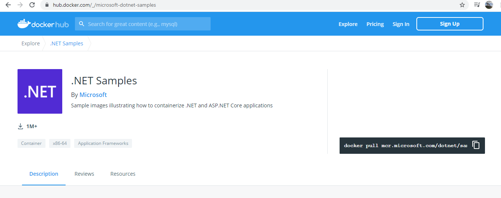


3. Verify that the image has been stored locally.

   

   ```
   docker image list
   ```

   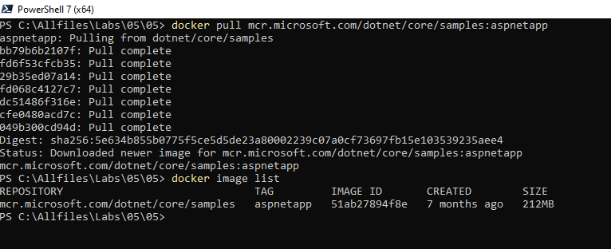

   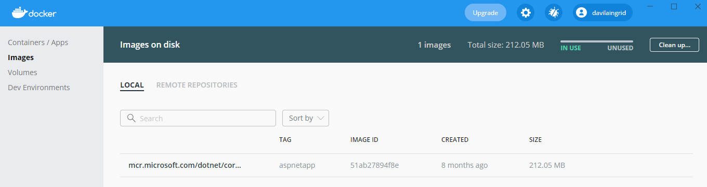

   You should see a repository named *mcr.microsoft.com/dotnet/core/samples* with a tag of *aspnetapp*.

4. Start the sample app. Specify the -d flag to run it as a background, non-interactive app. Use the -p flag to map port 80 in the container that is created to port 8080 locally, to avoid conflicts with any web apps already running on your computer. The command will respond with a lengthy hexadecimal identifier for the instance.

   

   ```
   docker run -d -p 8080:80 mcr.microsoft.com/dotnet/core/samples:aspnetapp
   ```

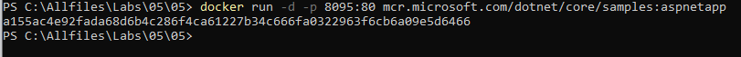

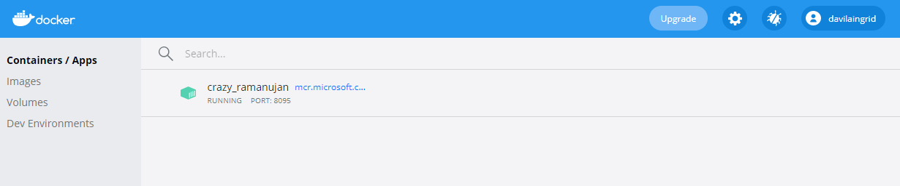
   

5. Open a web browser and go to the page for the sample web app at [http://localhost:8080](http://localhost:8080/).

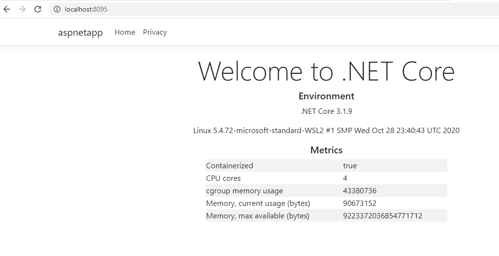

#### Examine the container in the local Docker registry

1. At the command prompt, view the running containers in the local registry.

   

   ```
   docker ps
   ```

   

   The output should look similar to this:

   ```
   CONTAINER ID        IMAGE                                COMMAND                  CREATED             STATUS              PORTS                  NAMES bffd59ae5c22        mcr.microsoft.com/dotnet/core/samples:aspnetapp   "dotnet aspnetapp.dll"   12 seconds ago      Up 11 seconds       0.0.0.0:8080->80/tcp   competent_hoover
   ```

   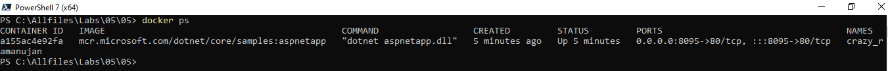

   The **COMMAND** field shows the container started by running the command *dotnet aspnetapp.dll*. This command invokes the .NET Core runtime to start the code in the aspnetapp.dll (the code for the sample web app). The *PORTS* field indicates port 80 in the image was mapped to port 8080 on your computer. The *STATUS* field shows the application is still running. Make a note of the container's *NAME*.

   Attach or start a command line inside container: (cmd for windos, bin/bash for linux):

   ```
   docker exec -it <CONTAINER ID> cmd
   ```

   to copy some file into container, the container must be stoped:

   ```
   docker cp <FILE> <CONTAINER ID>
   ```

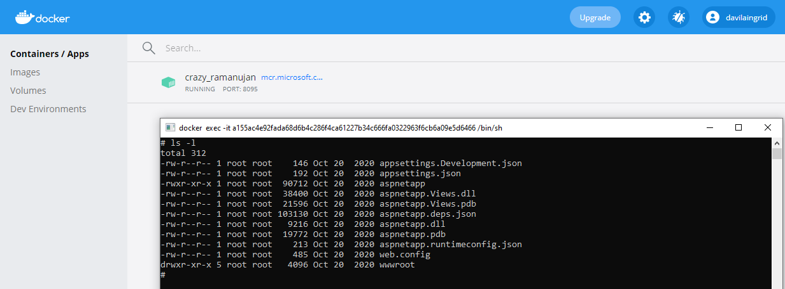


2. Stop the Docker container. Specify the container name for the web app in the following command, in place of <NAME>.

   ```
   docker container stop <NAME>
   ```


3. Verify that the container is no longer running. The following command shows the status of the container as *Exited*. The -a flag shows the status of all containers, not just those that are still running.

   

   ```
   docker ps -a
   ```

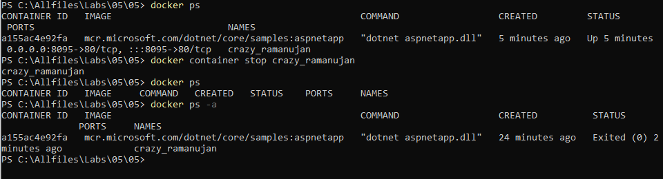

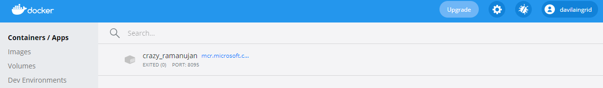

   

4. Return to the web browser and refresh the page for the sample web app. It should fail with a *Connection Refused* error.

#### Remove the container and image

1. Although the container has stopped, it's still loaded and can be restarted. Remove it using the following command. As before, replace <NAME> with the name of your container.

   

   ```
   docker container rm <NAME>
   ```

   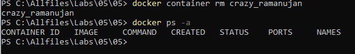

2. Verify that the container has been removed with the following command. The command should no longer list the container.

   

   ```
   docker ps -a
   ```

   

3. List the images currently available on your computer.

   

   ```
   docker image list
   ```

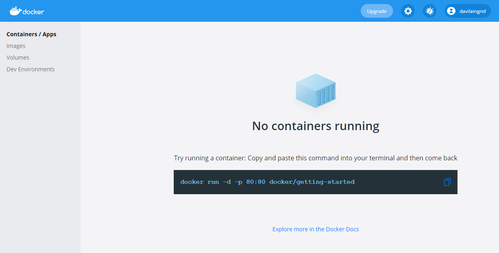
   
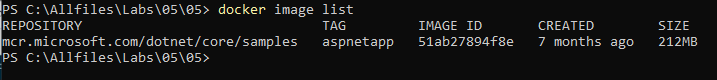

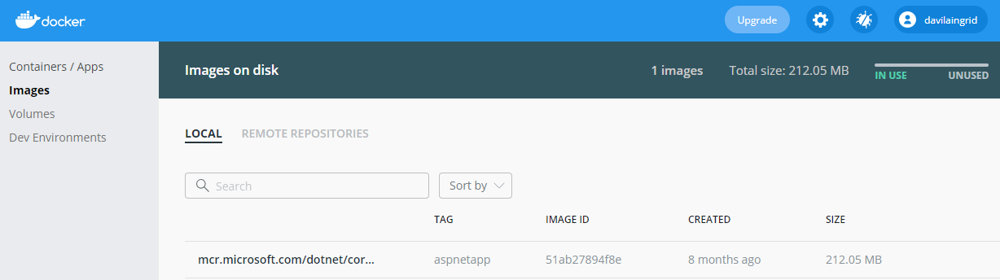

4. Remove the image from the registry.

   

   ```
   docker image rm mcr.microsoft.com/dotnet/core/samples:aspnetapp
   ```

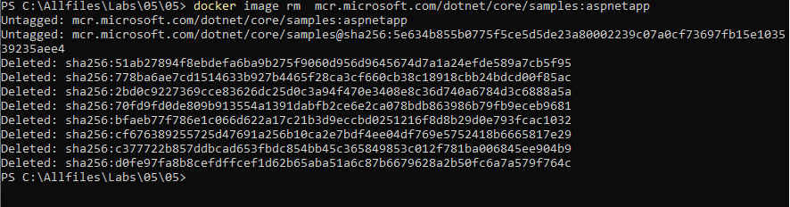
   

5. List the images again to verify that the image for the *microsoft/dotnet-samples* web app has disappeared.

   

   ```
   docker image list
   ```

   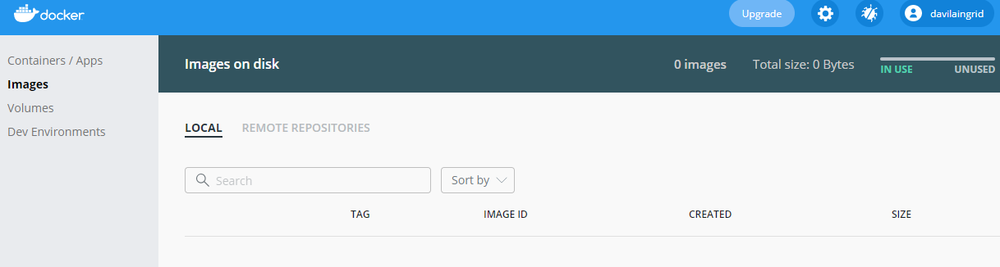

