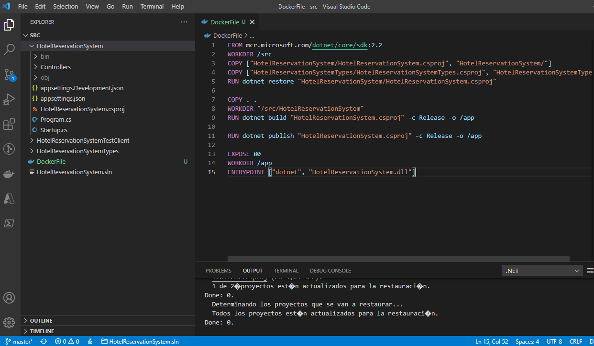
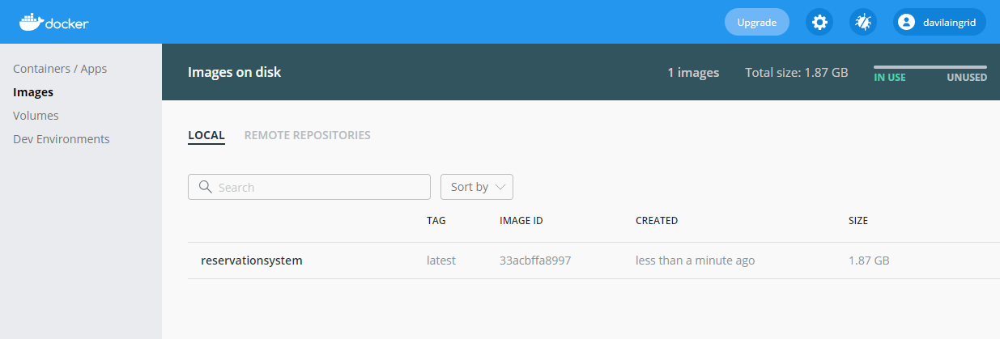
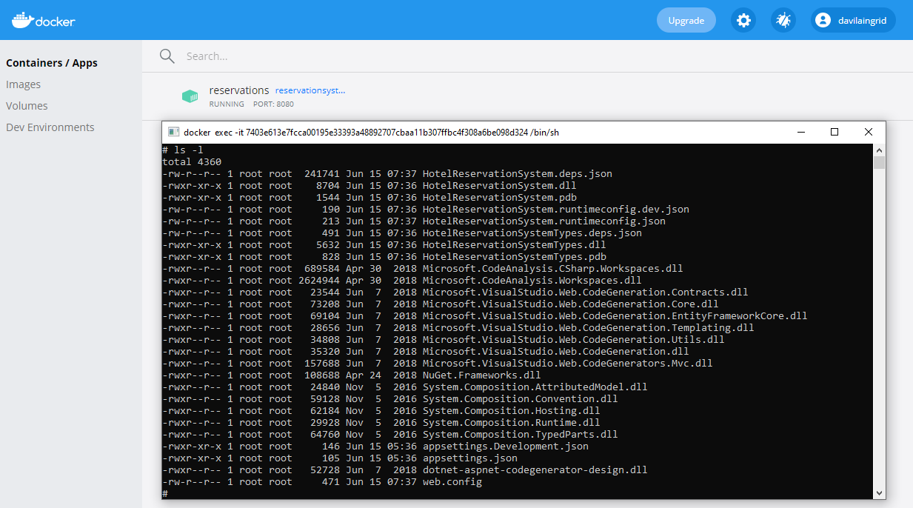

### Demo: Create a container image by using Docker

In this demo, you will learn to perform the following actions:

- Create a Dockerfile
- Build and deploy the image
- Test the web app

#### Prerequisites

- A local installation of Docker
  - https://www.docker.com/products/docker-desktop
- A local installation of Git
  - https://desktop.github.com/

✔️ **Note:** The sample web app used in this demo implements a web API for a hotel reservations web site. The web API exposes HTTP POST and GET operations that create and retrieve customer's bookings. The data is not persisted and queries return sample data.

#### Create a Dockerfile for the web app

1. In a command prompt on your local computer, create a folder for the project and then run the following command to download the source code for the web app.

   ``` 
   git clone https://github.com/MicrosoftDocs/mslearn-hotel-reservation-system.git
   ```


2. Move to the src folder.

   ```
   cd mslearn-hotel-reservation-system/src
   ```

   

3. In this directory, create a new file named *Dockerfile* with no file extension and open it in a text editor.

   ```
   echo "" > Dockerfile 
   notepad Dockerfile
   ```

   

4. Add the following commands to the *Dockerfile*. Each section is explained in the table below.

   ```
   #1 
   FROM mcr.microsoft.com/dotnet/core/sdk:2.2 
   WORKDIR /src 
   COPY ["HotelReservationSystem/HotelReservationSystem.csproj", "HotelReservationSystem/"] 
   COPY ["HotelReservationSystem/Controllers/*.cs", "HotelReservationSystem/Controlers/"] 
   COPY ["HotelReservationSystem/*.cs", "HotelReservationSystem/"] 
   COPY ["HotelReservationSystem/*.json", "HotelReservationSystem/"] 
   
   COPY ["HotelReservationSystemTypes/HotelReservationSystemTypes.csproj", "HotelReservationSystemTypes/"] 
   COPY ["HotelReservationSystemTypes/*.cs", "HotelReservationSystemTypes/"] 
   RUN dotnet restore "HotelReservationSystem/HotelReservationSystem.csproj" 
   
   #2 COPY . . 
   WORKDIR "/src/HotelReservationSystem" 
   RUN dotnet build "HotelReservationSystem.csproj" -c Release -o /app 
   
   #3 
   RUN dotnet publish "HotelReservationSystem.csproj" -c Release -o /app 
   
   #4 
   EXPOSE 80 
   WORKDIR /app 
   ENTRYPOINT ["dotnet", "HotelReservationSystem.dll"]
   
   ```

   

   | Ref # | Dockerfile command description                               |
   | ----- | ------------------------------------------------------------ |
   | #1    | These commands fetch an image containing the .NET Core Framework SDK. The project files for the web app (HotelReservationSystem.csproj) and the library project (HotelReservationSystemTypes.csproj) are copied to the /src folder in the container. The dotnet restore command downloads the dependencies required by these projects from NuGet. |
   | #2    | These commands copy the source code for the web app to the container and then run the dotnet build command to build the app. The resulting DLLs are written to the /app folder in the container. |
   | #3    | The dotnet publish command copies the executables for the web site to a new folder and removes any interim files. The files in this folder can then be deployed to a web site. |
   | #4    | The first command opens port 80 in the container. The second command moves to the /app folder containing the published version of the web app. The final command specifies that when the container runs it should execute the command dotnet HotelReservationSystem.dll. This library contains the compiled code for the web app |

1. Save the file and close your text editor.



#### Build and deploy the image using the Dockerfile

1. At the command prompt, run the following command to build the image for the sample app using the Dockerfile and store it locally. Don't forget the . at the end of the command.

   

   ```
   docker build -t reservationsystem .
   ```

   

   ✔️ **Note:** A warning about file and directory permissions will be displayed when the process completes. You can ignore these warnings for the purposes of this exercise.

2. Run the following command to verify that the image has been created and stored in the local registry.

   

   ```
   docker image list
   ```


   

   The image will have the name reservationsystem. You'll also see an image named *microsoft/dotnet*. This image contains the .NET Core SDK and was downloaded when the reservationsystem image was built using the Dockerfile.

#### Test the web app

1. Run a container using the reservationsystem image using the following command. Docker will respond with a lengthy string of hex digits – the container runs in the background without any UI. Port 80 in the container is mapped to port 8080 on the host machine. The container is named reservations.

   

   ```
   docker run -p 8080:80 -d --name reservations reservationsystem
   ```

   

2. Start a web browser and navigate to http://localhost:8080/api/reservations/1. You should see a JSON document containing the data for reservation number 1 returned by the web app. You can replace the “1” with any reservation number, and you'll see the corresponding reservation details.

3. Examine the status of the container using the following command.

   

   ```
   docker ps -a
   ```

   

   Verify that the status of the container is Up.

   ```
   CONTAINER ID        IMAGE               COMMAND                  CREATED             STATUS              PORTS                  NAMES 07b0d1de4db7        reservationsystem   "dotnet HotelReserva…"   5 minutes ago       Up 5 minutes        0.0.0.0:8080->80/tcp   reservations
   
   ```

   

   

   

3. Stop the *reservations* container with the following command.

   

   ```
   docker container stop reservations
   ```


   


4. Delete the *reservations* container from the local registry.

   

   ```
   docker rm reservations
   ```

   


5. Delete the images from the local registry.

   

   ```
   docker image rm <image_name>
   ```

   

   