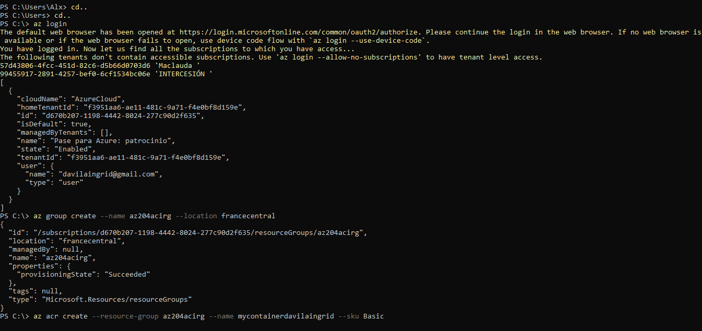
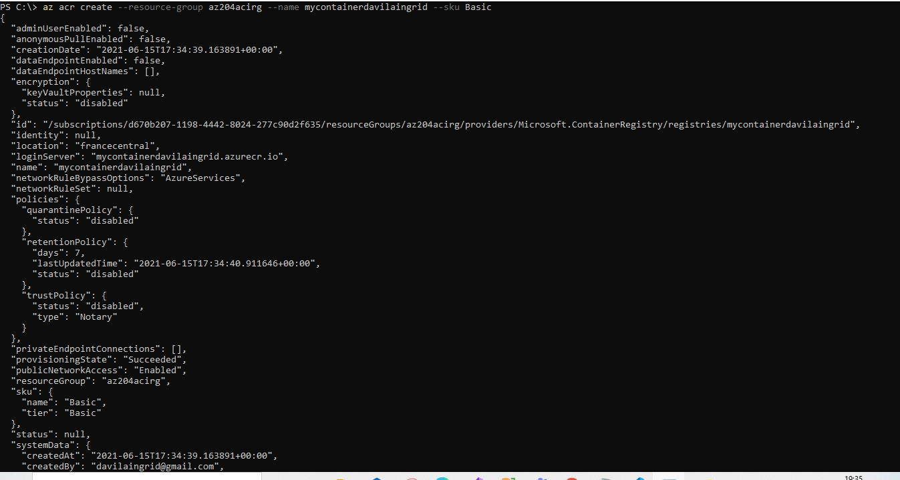
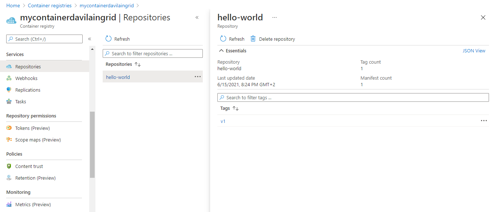
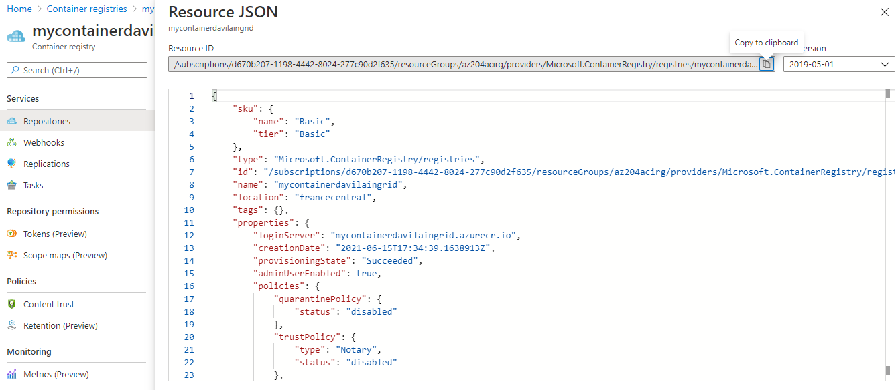
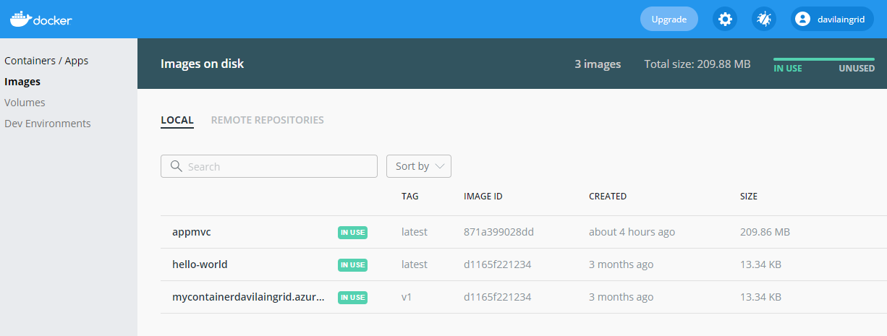
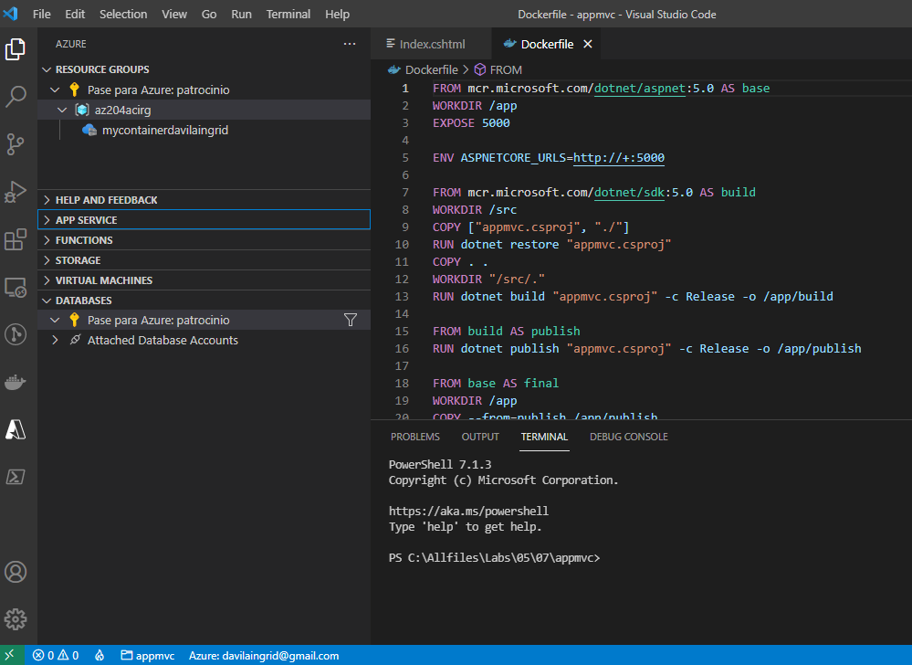
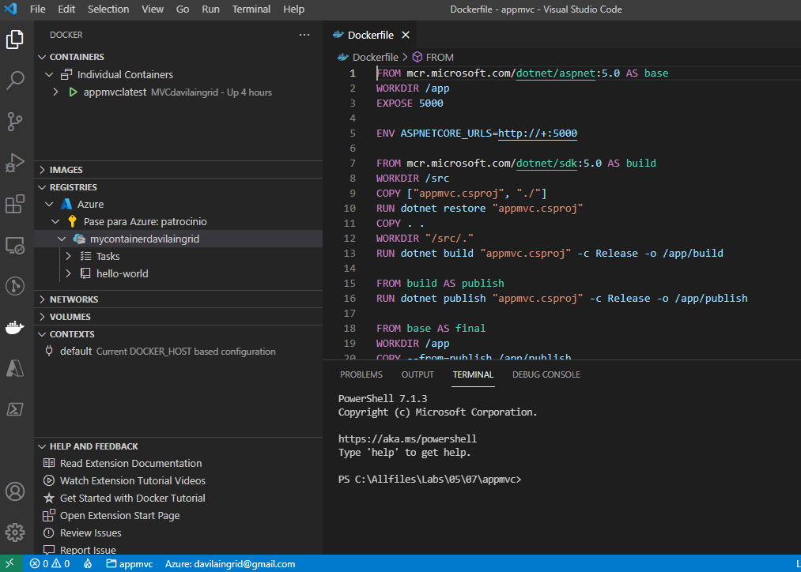
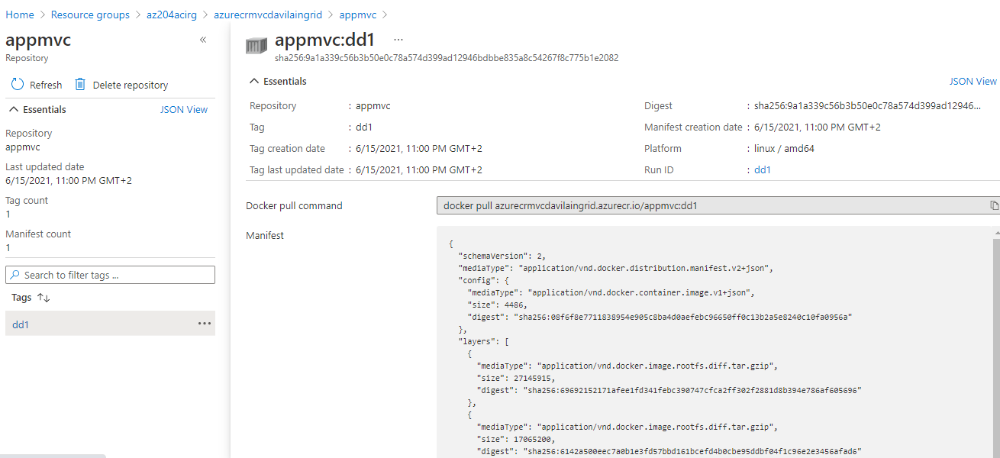
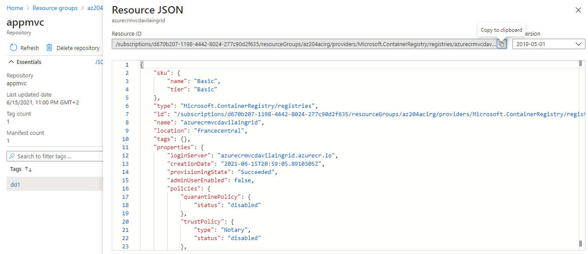

### Demo: Deploy an image to ACR by using Azure CLI

In this demo you'll learn how to perform the following actions:

- Create an Azure Container Registry
- Push an image to the ACR
- Verify the image was uploaded
- Run an image from the ACR

#### Prerequisites

- A local installation of Docker
  - https://www.docker.com/products/docker-desktop
- A local installation of Azure CLI
  - https://docs.microsoft.com/en-us/cli/azure/install-azure-cli

✔️ **Note:** Because the Azure Cloud Shell doesn't include all required Docker components (the dockerd daemon), you can't use the Cloud Shell for this demo.

#### Create an Azure Container Registry

1. Connect to azure

   

   ```
   az login
   ```

   

2. Create a resource group for the registry, replace <myResourceGroup> and <myLoc

ation> in the command below with your own values.


```
az group create --name myResourceGroup01 --location francecentral
```




1. Create a basic container registry. The registry name must be unique within Azure, and contain 5-50 alphanumeric characters. In the following example, *myContainerRegistry007* is used. Update this to a unique value.

   

   ```
   az acr create --resource-group myResourceGroup01 --name myCRbmv --sku Basic
   ```

   

   When the registry is created, the output is similar to the following:

   

   ```
   {
     "adminUserEnabled": false,
     "creationDate": "2017-09-08T22:32:13.175925+00:00",
     "id": "/subscriptions/00000000-0000-0000-0000-000000000000/resourceGroups/myResourceGroup/providers/Microsoft.ContainerRegistry/registries/myContainerRegistry007",
     "location": "eastus",
     "loginServer": "myContainerRegistry007.azurecr.io",
     "name": "myContainerRegistry007",
     "provisioningState": "Succeeded",
     "resourceGroup": "myResourceGroup",
     "sku": {
       "name": "Basic",
       "tier": "Basic"
     },
     "status": null,
     "storageAccount": null,
     "tags": {},
     "type": "Microsoft.ContainerRegistry/registries"
   }
   ```




❗️ **Important:** Throughout the rest of this demo myCRbmv is a placeholder for the container registry name you created. You'll need to use that name throughout the rest of the demo.

#### Push an image to the registry

1. Before pushing and pulling container images, you must log in to the ACR instance. To do so, use the az acr login command.

   

   ```
   docker login azure
   
   az acr login --name myCRbmv
   ```

   

2. Download an image, we'll use the hello-world image for the rest of the demo.

   

   ```
   docker pull hello-world
   ```


3. Tag the image using the docker tag command. Before you can push an image to your registry, you must tag it with the fully qualified name of your ACR login server. The login server name is in the format myCRbmv.azurecr.io (all lowercase).

   

   ```
   docker tag hello-world myCRbmv.azurecr.io/hello-world:v1
   ```


4. Finally, use docker push to push the image to the ACR instance. This example creates the **hello-world** repository, containing the hello-world:v1 image.

   

   ```
   docker push myCRbmv.azurecr.io/hello-world:v1
   ```




















5. After pushing the image to your container registry, remove the hello-world:v1 image from your local Docker environment.

   

   ```
   docker rmi myCRbmv.azurecr.io/hello-world:v1
   ```

   

   ✔️ **Note:** This docker rmi command does not remove the image from the **hello-world** repository in your Azure container registry, only the local version.

#### Verify the image was uploaded

1. Use the az acr repository list command to list the repositories in your registry.

   

   ```
   az acr repository list --name myCRbmv --output table
   ```

   

   Output:

   Result ---------------- hello-world

2. Use the az acr repository show-tags command to list the tags on the **hello-world** repository.

   

   ```
   az acr repository show-tags --name myCRbmv --repository hello-world --output table
   ```

   

   Output:

   Result -------- v1

#### Run image from registry

1. Pull and run the hello-world:v1 container image from your container registry by using the docker run command.

   

   ```
   docker run myCRbmv.azurecr.io/hello-world:v1
   ```

   

   Example output:

   Unable to find image 'mycontainerregistry007.azurecr.io/hello-world:v1' locally v1: Pulling from hello-world Digest: sha256:662dd8e65ef7ccf13f417962c2f77567d3b132f12c95909de6c85ac3c326a345 Status: Downloaded newer image for mycontainerregistry007.azurecr.io/hello-world:v1 Hello from Docker! This message shows that your installation appears to be working correctly. [...]

#### Clean up resources

When no longer needed, you can use the az group delete command to remove the resource group, the container registry, and the container images stored there.


```
az group delete --name <myResourceGroup>
```