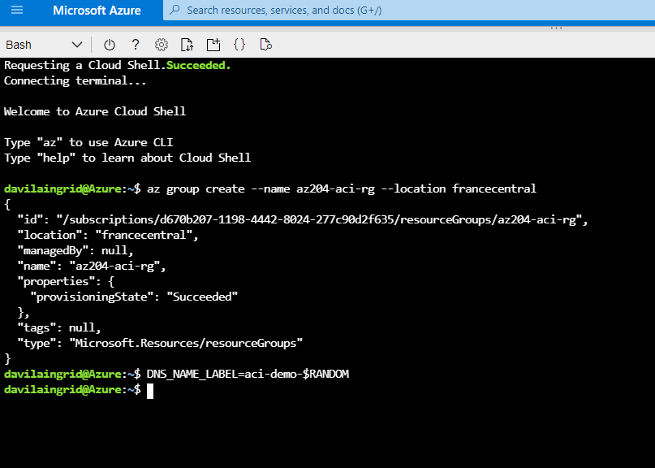
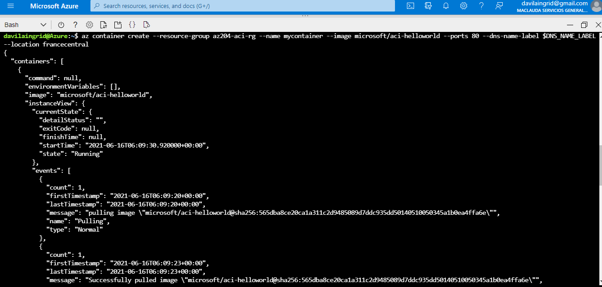
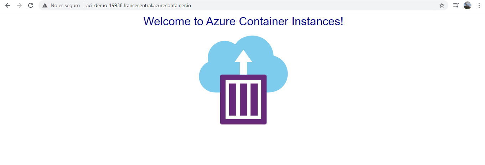
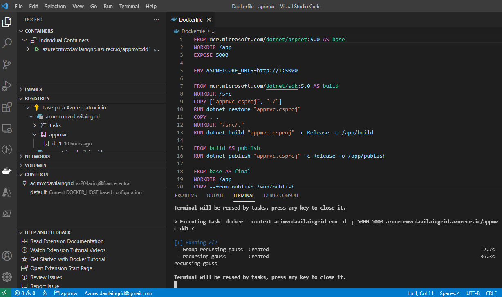
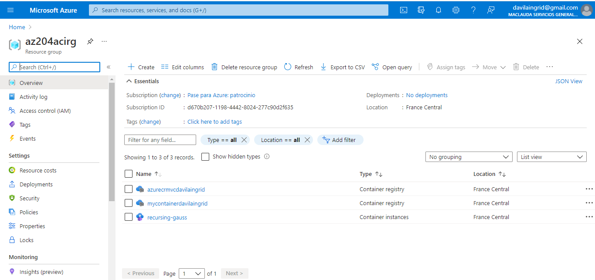
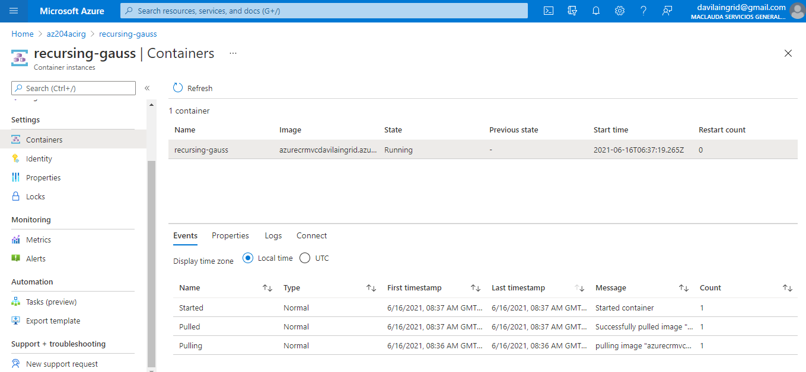
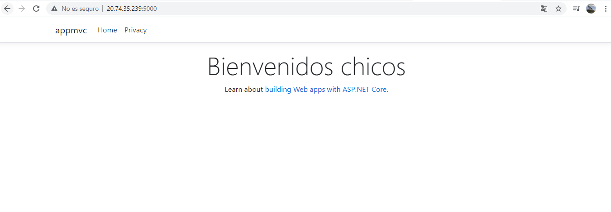

### Demo: Run Azure Container Instances by using the Cloud Shell

In this demo you'll learn how to perform the following actions:

- Create a resource group for the container
- Create a container
- Verify the container is running

#### Prerequisites

- An Azure subscription, if you don't have an Azure subscription, create a free account before you begin.
  - https://azure.microsoft.com/free/

#### Create the resource group

1. Sign into the [Azure portal ](https://portal.azure.com/)with your Azure subscription.

2. Open the Azure Cloud Shell from the Azure portal using the Cloud Shell icon, and select **Bash** as the shell option.

   

3. Create a new resource group with the name **az204-aci-rg** so that it will be easier to clean up these resources when you are finished with the module. Replace <myLocation> with a region near you.

   ```
   az group create --name az204-aci-rg --location <myLocation>
   ```



#### Create a container

You create a container by providing a name, a Docker image, and an Azure resource group to the az container create command. You will expose the container to the Internet by specifying a DNS name label.

1. Create a DNS name to expose your container to the Internet. Your DNS name must be unique, run this command from Cloud Shell to create a Bash variable that holds a unique name.

   ```
   DNS_NAME_LABEL=aci-demo-$RANDOM
   ```

   

2. Run the following az container create command to start a container instance. Be sure to replace the <myLocation> with the region you specified earlier. It will take a few minutes for the operation to complete.

   ```
   az container create \
   --resource-group az204-aci-rg \
   --name mycontainer \
   --image microsoft/aci-helloworld \
   --ports 80 \
   --dns-name-label $DNS_NAME_LABEL \
   --location <myLocation>
   ```

   In the command above, $DNS_NAME_LABEL specifies your DNS name. The image name, **microsoft/aci-helloworld**, refers to a Docker image hosted on Docker Hub that runs a basic Node.js web application.





#### Verify the container is running

1. When the az container create command completes, run az container show to check its status.

   ```
   az container show \
   --resource-group az204-aci-rg \
   --name mycontainer \
   --query "{FQDN:ipAddress.fqdn,ProvisioningState:provisioningState}" \
   --out table
   ```

   

   You see your container's fully qualified domain name (FQDN) and its provisioning state. Here's an example.
```
FQDN											ProvisioningState 
--------------------------------------  		-------------------
aci-demo.eastus.azurecontainer.io       		Succeeded
```
   ✔️ **Note:** If your container is in the **Creating** state, wait a few moments and run the command again until you see the **Succeeded** state.

2. From a browser, navigate to your container's FQDN to see it running. You may get a warning that the site isn't safe.














#### Clean up resources

When no longer needed, you can use the az group delete command to remove the resource group, the container registry, and the container images stored there.

```
az group delete --name az204-aci-rg --no-wait --yes
```