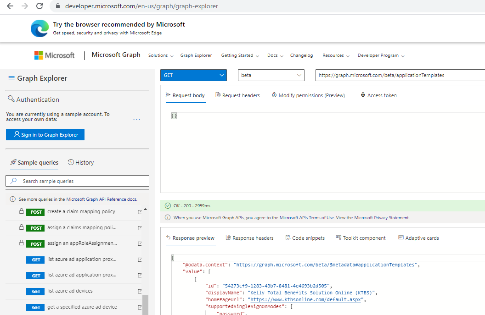
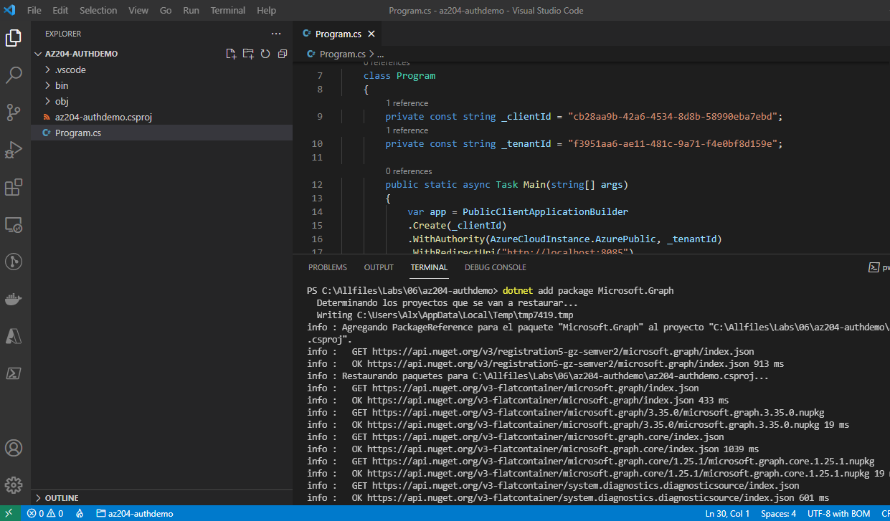
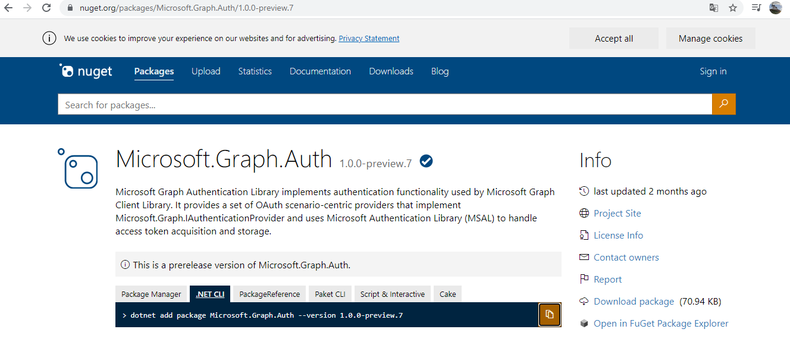
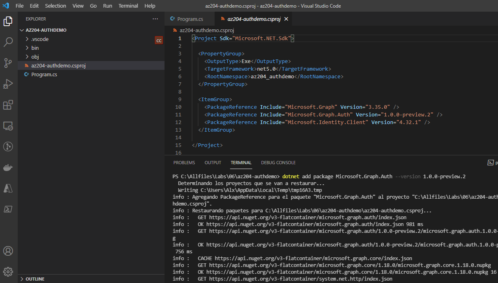
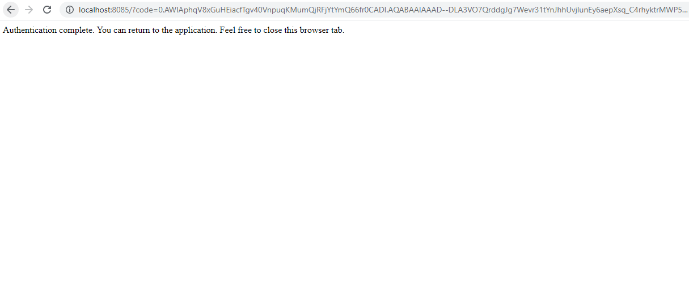
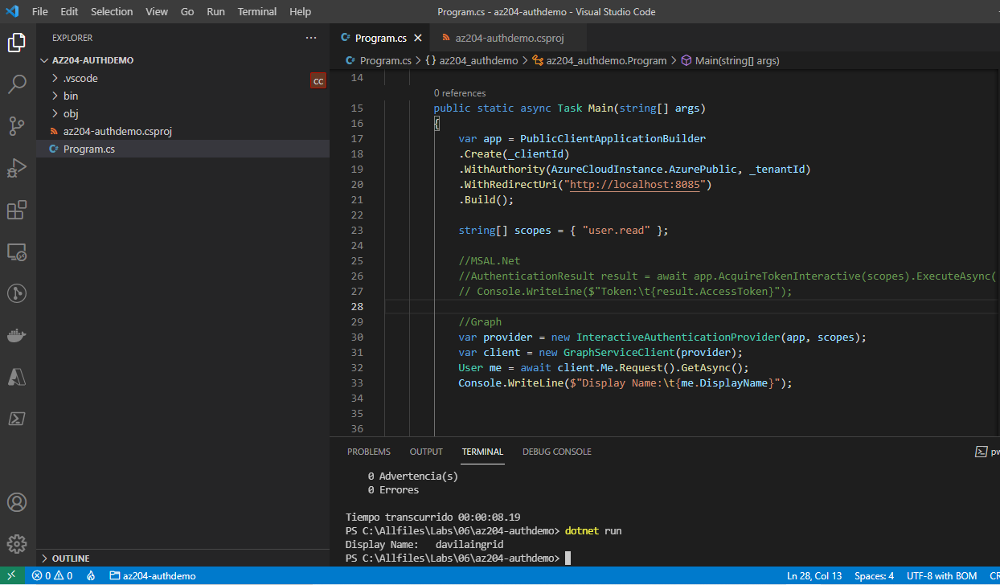

### Demo: Retrieving profile information by using the Microsoft Graph SDK

In this demo you'll learn how to perform the following actions:

- Use the following two libraries:
  - **Microsoft.Graph**: used to query Microsoft Graph
  - **Microsoft.Graph.Auth**: used to plug in to MSAL.NET for authentication
- Retrieve user display name

#### Prerequisites

This demo is performed in Visual Studio Code. We'll be re-using *az204-authdemo* app we created in the *Interactive authentication by using MSAL.NET* demo.

##### Open project in Visual Studio Code

1. Open the *az204-authdemo* project from the previous lesson.
2. Open the terminal in Visual Studio Code

#### Build the console app

##### Add packages and using statements

1. Add the **Microsoft.Graph** and **Microsoft.Graph.Auth** packages to the project. The **Microsoft.Graph.Auth** is in preview at the time this was written, so we'll add a compatible preview version to the project.

   dotnet add package Microsoft.Graph dotnet add package Microsoft.Graph.Auth --version 1.0.0-preview.2

2. Add using statements to include the libraries.

   

   ```
   using Microsoft.Graph;
   using Microsoft.Graph.Auth;
   ```

   

##### Clean up code no longer needed in the project

1. Delete the following code from *Program.cs*.

   

   ```
   AuthenticationResult result = await app.AcquireTokenInteractive(scopes).ExecuteAsync();
   Console.WriteLine($"Token:\t{result.AccessToken}");
   ```

   

##### Add code to authenticate and retrieve profile information

1. Microsoft Graph requires an authentication provider. We'll use InteractiveAuthenticationProvider and pass it the public client application app, and the IEnumerable scopes string.

   

   ```
   var provider = new InteractiveAuthenticationProvider(app, scopes);
   ```

   

2. Add code for the Microsoft Graph client. The code below creates the Graph services client and passes it the authentication provider.

   

   ```
   var client = new GraphServiceClient(provider);
   ```

   

3. Add code to request the information from Microsoft Graph and write the DisplayName to the console.

   

   ```
   User me = await client.Me.Request().GetAsync();
   Console.WriteLine($"Display Name:\t{me.DisplayName}");
   ```

   

#### Run the application

1. In the VS Code terminal run dotnet build to check for errors, then dotnet run to run the app.

2. The app will open the default browser prompting you to select the account you want to authenticate with. If there are multiple accounts listed select the one associated with the tenant used in the app.

3. You should see the following results in the console.

   Display Name:  <display name associated with the account>

















