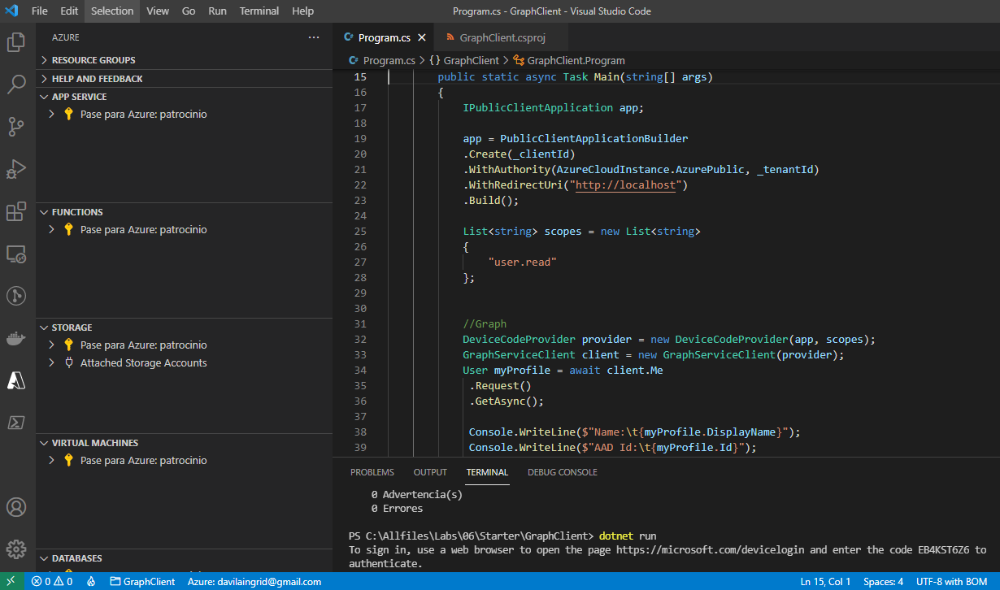

# Lab 06: 

## Escenario de laboratorio
As a new employee at your company, you signed in to your Microsoft 365 applications for the first time and discovered that your profile information isn't accurate. You also noticed that the name and profile picture when you sign in aren't correct. Rather than change these values manually, you have decided that this is a good opportunity to learn the Microsoft identity platform and how you can use different libraries such as the Microsoft Authentication Library (MSAL) and the Microsoft Graph SDK to change these values in a programmatic manner.

## Objetivos
After you complete this lab, you will be able to:

Create a new application registration in Azure Active Directory (Azure AD).

Use the MSAL.NET library to implement the interactive authentication flow.

Obtain a token from the Microsoft identity platform by using the MSAL.NET library.

Query Microsoft Graph by using the Microsoft Graph SDK and the device code flow.

