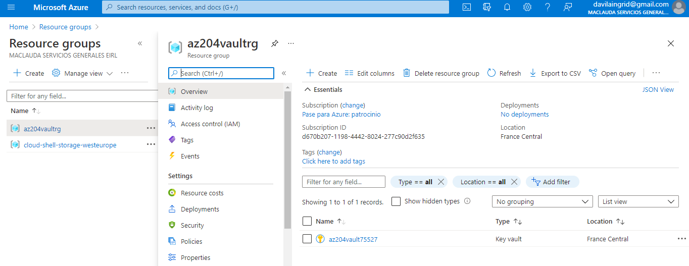
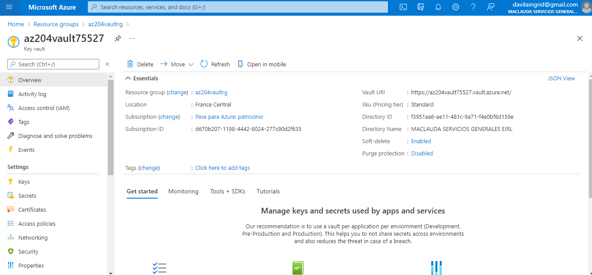
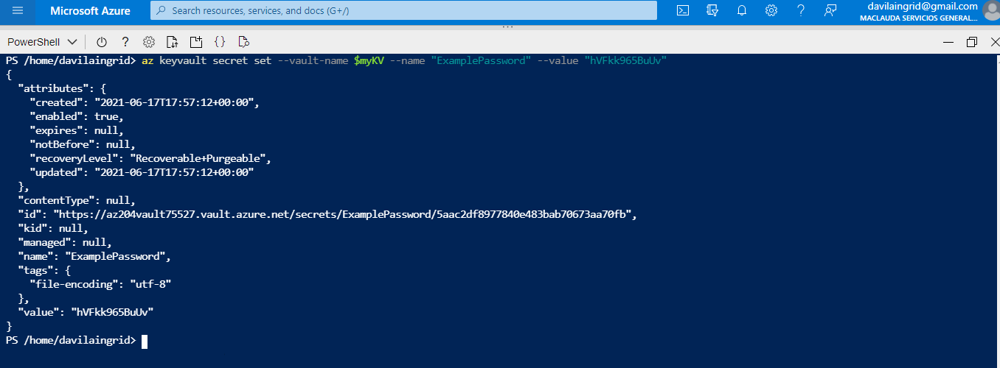
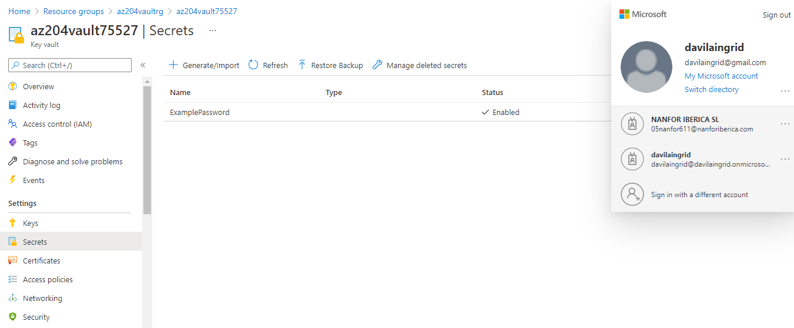
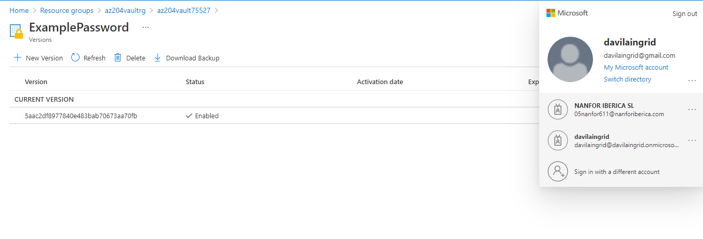
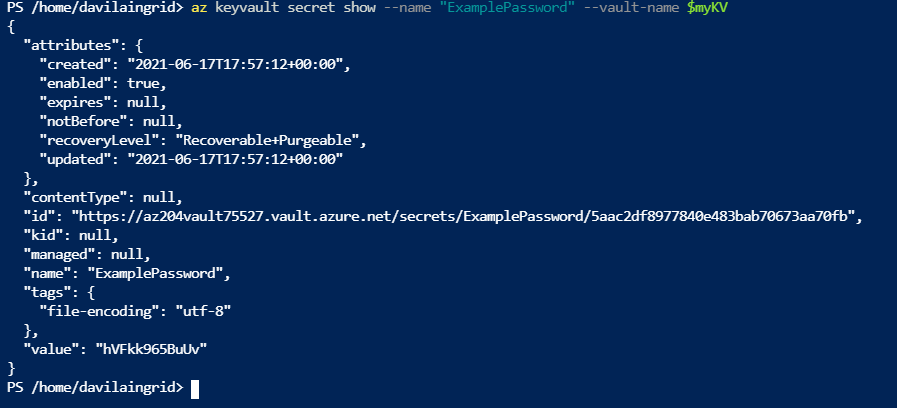

### Demo: Set and retrieve a secret from Azure Key Vault by using Azure CLI

In this demo you'll learn how to perform the following actions:

- Create a Key Vault
- Add and retrieve a secret

#### Prerequisites

This demo is performed in either the Cloud Shell or a local Azure CLI installation.

- Cloud Shell: be sure to select **PowerShell** as the shell.
- If you need to install Azure CLI locally visit:
  - https://docs.microsoft.com/en-us/cli/azure/install-azure-cli

##### Login to Azure

1. Choose to either:
   - Launch the Cloud Shell: [https://shell.azure.com](https://shell.azure.com/)
   - Or, open a terminal and login to your Azure account using the az login command.

#### Create a Key Vault

1. Set variables. Let's set some variables for the CLI commands to use to reduce the amount of retyping. Replace the <myLocation> variable string below with a region that makes sense for you. The Key Vault name needs to be a globally unique name, and the script below generates a random string.

   

   ```
   $myResourceGroup="az204vaultrg"
   $myKeyVault="az204vault" + $(get-random -minimum 10000 -maximum 100000)
   $myLocation="<myLocation>"
   ```


2. Create a resource group.

   

   ```
   az group create --name $myResourceGroup --location $myLocation
   ```


   

3. Create a Key Vault.

   

   ```
   az keyvault create --name $myKeyVault --resource-group $myResourceGroup --location $myLocation
   ```

   


   ✔️ **Note:** This can take a few minutes to run.







#### Add and retrieve a secret

To add a secret to the vault, you just need to take a couple of additional steps.

1. Create a secret. Let's add a password that could be used by an app. The password will be called **ExamplePassword** and will store the value of **hVFkk965BuUv** in it.


   

   ```
   az keyvault secret set --vault-name $myKeyVault --name "ExamplePassword" --value "hVFkk965BuUv"
   ```


   

2. Retrieve the secret.

   

   ```
   az keyvault secret show --name "ExamplePassword" --vault-name $myKeyVault
   ```

   

   This command will return some JSON. The last line will contain the password in plain text.

   

   ```
   "value": "hVFkk965BuUv"
   ```








   





#### Clean up resources

When you no longer need the resources in this demo use the following command to delete the resource group and associated Key Vault.


```
az group delete --name $myResourceGroup --no-wait --yes
```