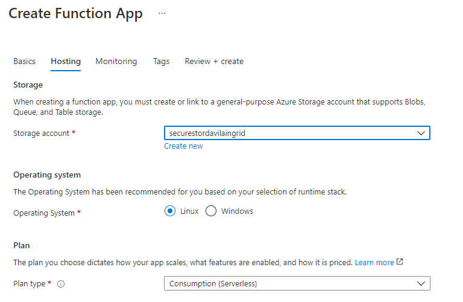
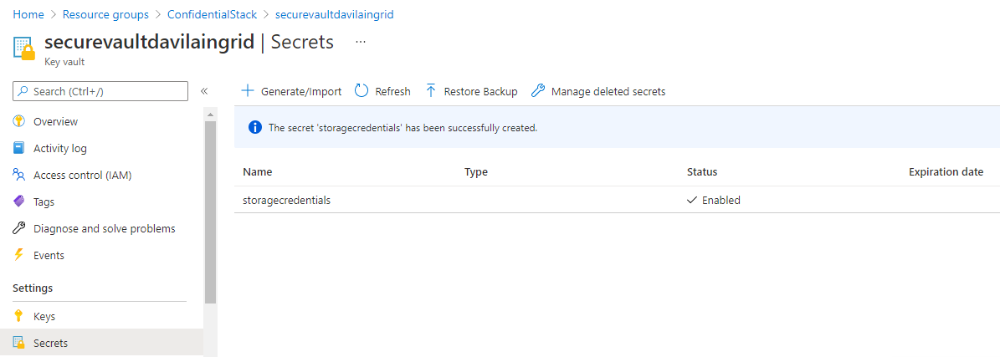
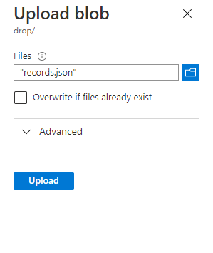

# Lab 07: Access resource secrets more securely across services 

## Escenario de laboratorio
Your company has a data-sharing business-to-business (B2B) agreement with another local business in which you're expected to parse a file that's dropped off nightly. To keep things simple, the second company has decided to drop the file as a Microsoft Azure Storage blob every night. You're now tasked with devising a way to access the file and generate a secure URL that any internal system can use to access the blob without exposing the file to the internet. You have decided to use Azure Key Vault to store the credentials for the storage account and Azure Functions to write the code necessary to access the file without storing credentials in plaintext or exposing the file to the internet.

## Objetivos
After you complete this lab, you will be able to:

Create an Azure key vault and store secrets in the key vault.

Create a server-assigned managed identity for an Azure App Service instance.

Create a Key Vault access policy for an Azure Active Directory identity or application.

Use the Storage .NET SDK to download a blob.

