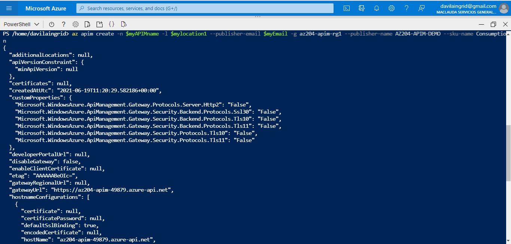
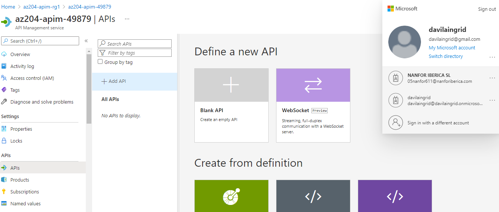
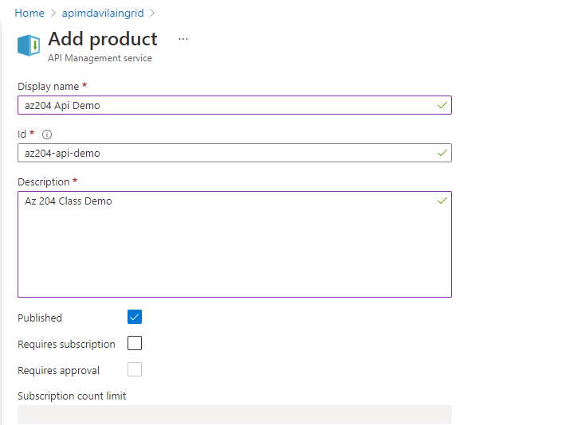

### Demo: Create an APIM instance by using Azure CLI

In this demo you'll learn how to perform the following actions:

- Create an APIM instance

✔️ **Note:** In this demo we're creating an APIM instance in the Consumption plan. Currently this plan doesn't support integration with AAD.

#### Prerequisites

This demo is performed in the Cloud Shell.

- Cloud Shell: be sure to select **PowerShell** as the shell.

##### Login to Azure

1. Choose to either:
   - Launch the Cloud Shell: [https://shell.azure.com](https://shell.azure.com/)
   - Or, login to the [Azure portal](https://portal.azure.com/) and open open the cloud shell there.

#### Create an APIM instance

1. Create a resource group. The commands below will create a resource group named *az204-apim-rg*. Enter a region that suits your needs.

   ```powershell
   $myLocation = Read-Host -Prompt "Enter the region (i.e. westus): "
   az group create -n az204-apim-rg -l $myLocation
   ```


   

2. Create an APIM instance. The name of your APIM instance needs to be unique. The first line in the example below generates a unique name. You also need to supply an email address.

   ```powershell
   $myEmail = Read-Host -Prompt "Enter an email address: "
   $myAPIMname="az204-apim-" + $(get-random -minimum 10000 -maximum 100000)
   az apim create -n $myAPIMname -l $myLocation `
       --publisher-email $myEmail  `
       -g az204-apim-rg `
       --publisher-name AZ204-APIM-Demo `
       --sku-name Consumption
   ```


   

   ✔️ **Note:** Azure will send a notification to the email addres supplied above when the resource has been provisioned.










