### Demo: Route custom events to web endpoint by using the Azure CLI commands and Event Grid

In this demo you will learn how to:

- Enable an Event Grid resource provider
- Create a custom topic
- Create a message endpoint
- Subscribe to a custom topic
- Send an event to a custom topic

#### Prerequisites

This demo is performed in the Cloud Shell.

##### Login to Azure

1. Login in to the Azure Portal: [https://portal.azure.com](https://portal.azure.com/) and launch the Cloud Shell. Be sure to select **Bash** as the shell.

2. Create a resource group, replace <myRegion> with a location that makes sense for you.

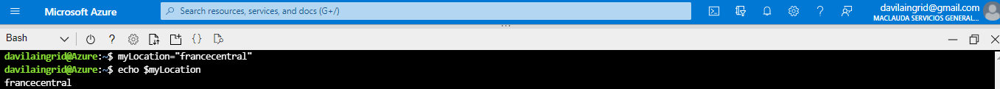   

   ```
   myLocation=<myRegion>
   az group create -n az204-egdemo-rg -l $myLocation
   ```


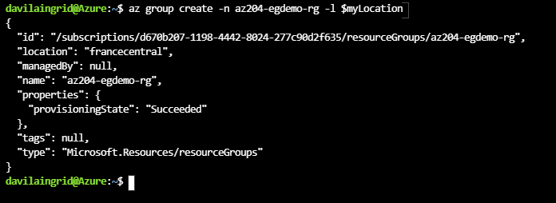

   

#### Enable Event Grid resource provider

✔️ **Note:** These step is only needed on subscriptions that haven't previously used Event Grid.

1. Register the Event Grid resource provider by using the az provider register command.

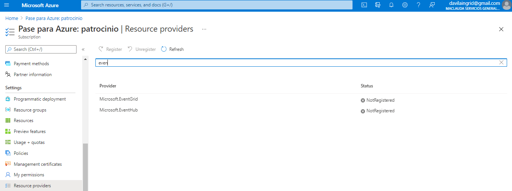   

   ```
   az provider register --namespace Microsoft.EventGrid
   ```
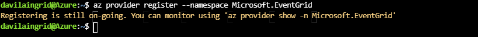
   

It can take a few minutes for the registration to complete. To check the status run the command below.

   
Por comando Shell:

   ```
   az provider show --namespace Microsoft.EventGrid --query "registrationState"
   ```

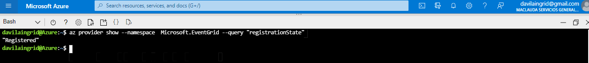


Por el Portal de Azure:

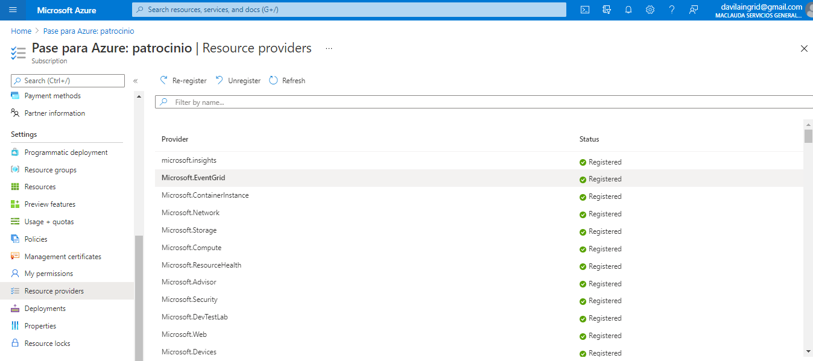
   

#### Create a custom topic

1. Create a custom topic by using the az eventgrid topic create command. The script below creates a unique topic name, the name must be unique because it's part of the DNS entry.

   
   ```
   let rNum=$RANDOM*$RANDOM
   myTopicName="az204-egtopic-${rNum}"
   az eventgrid topic create --name $myTopicName -l $myLocation -g az204-egdemo-rg
   ```

   
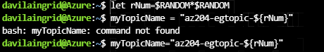


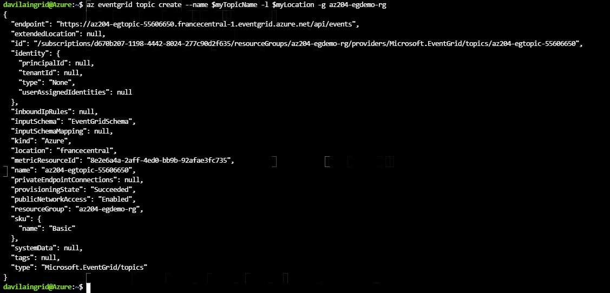


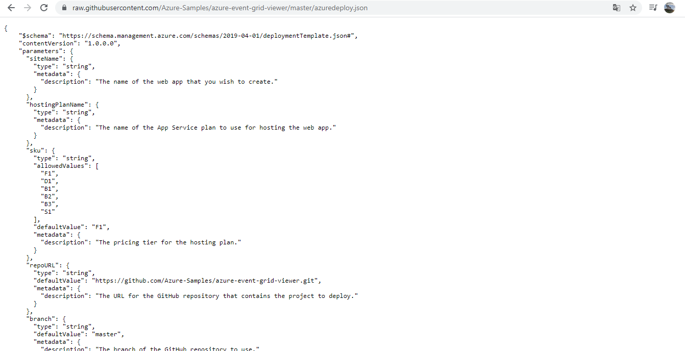


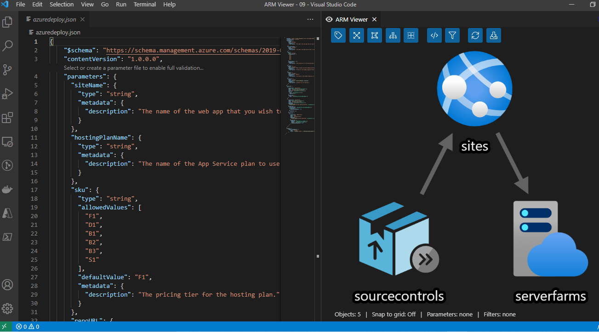


#### Create a message endpoint

Before subscribing to the custom topic, we need to create the endpoint for the event message. Typically, the endpoint takes actions based on the event data. The script below uses a pre-built web app that displays the event messages. The deployed solution includes an App Service plan, an App Service web app, and source code from GitHub. It also generates a unique name for the site.

1. Create a message endpoint. The deployment may take a few minutes to complete.

   

   ```
   mySiteName="az204-egsite-${rNum}"
   mySiteURL="https://${mySiteName}.azurewebsites.net"
   az group deployment create \
       -g az204-egdemo-rg \
       --template-uri "https://raw.githubusercontent.com/Azure-Samples/azure-event-grid-viewer/master/azuredeploy.json" \
       --parameters siteName=$mySiteName hostingPlanName=viewerhost
   echo "Your web app URL: ${mySiteURL}"
   ```

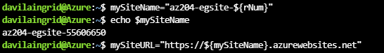


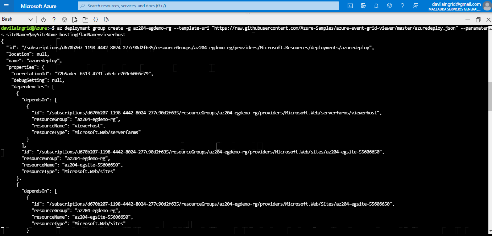


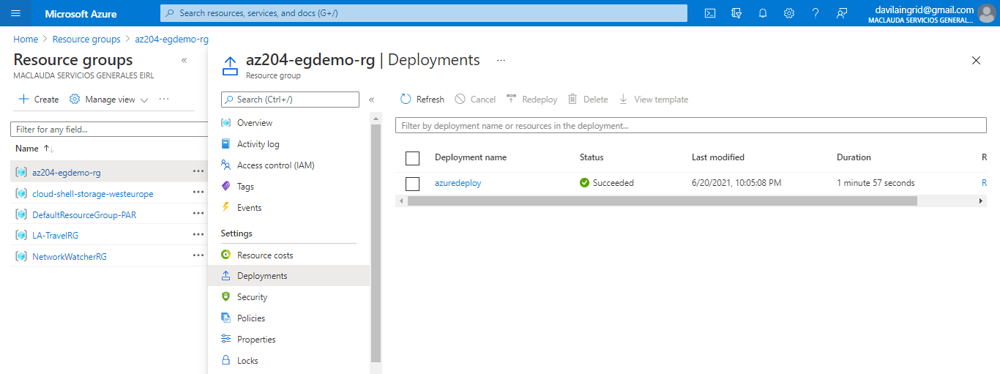


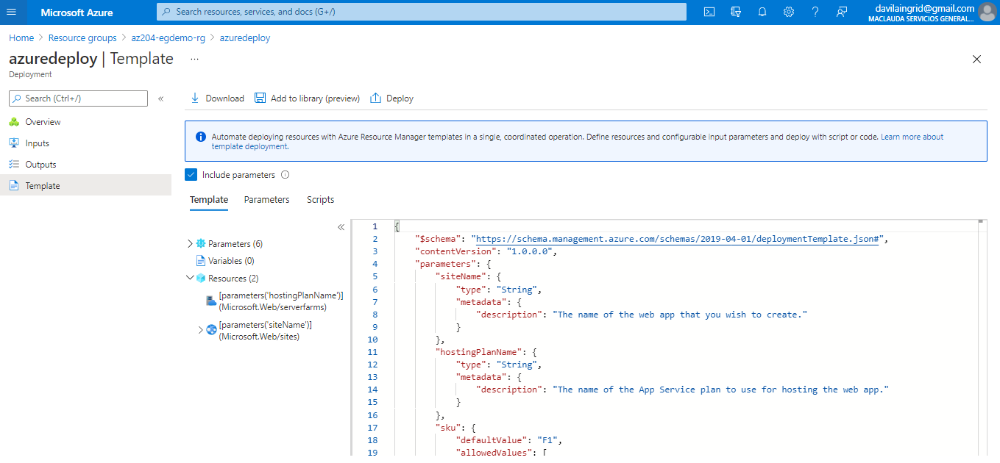


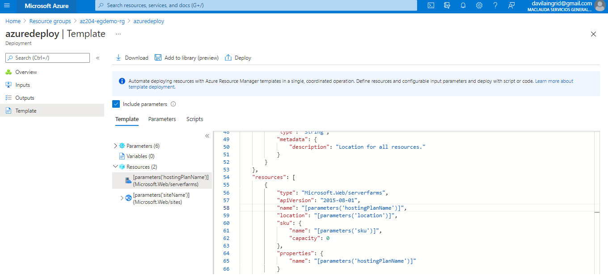


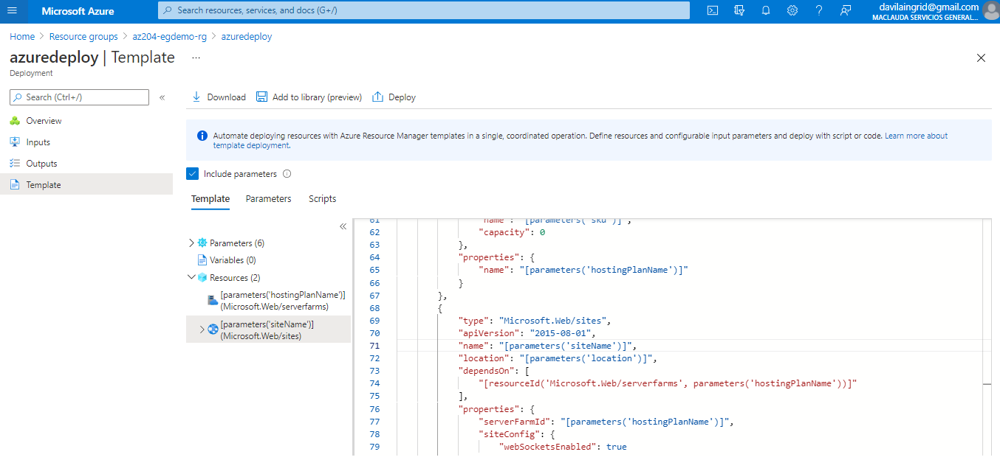


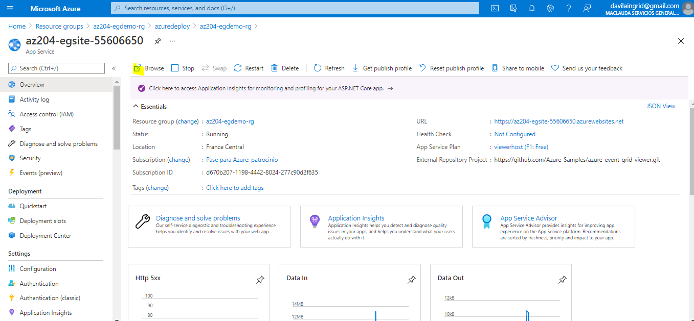


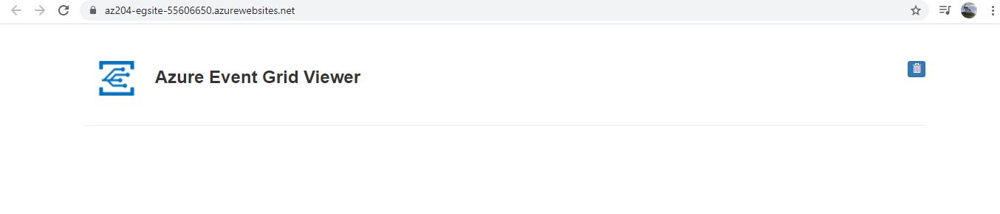


2. Navigate to the URL generated at the end of the script above to ensure the web app is running. You should see the site with no messages currently displayed.

✔️ **Note:** Leave the browser running, it is used to show updates.

#### Subscribe to a custom topic

You subscribe to an event grid topic to tell Event Grid which events you want to track and where to send those events.

1. Subscribe to a custom topic by using the az eventgrid event-subscription create command. The script below will grab the needed subscription ID from your account and use in the creation of the event subscription.

   

   ```
   endpoint="${mySiteURL}/api/updates"
   subId=$(az account show --subscription "" | jq -r '.id')
   
   az eventgrid event-subscription create \
   --source-resource-id "/subscriptions/$subId/resourceGroups/az204-egdemo-rg/providers/Microsoft.EventGrid/topics/$myTopicName" \
   --name demoViewerSub \
   --endpoint $endpoint
   ```

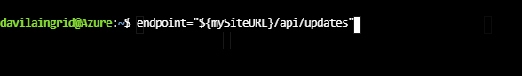


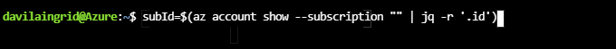


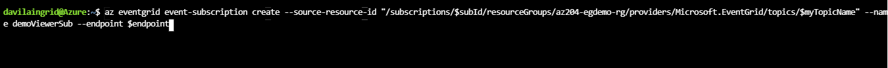

   

2. View your web app again, and notice that a subscription validation event has been sent to it. Select the eye icon to expand the event data. Event Grid sends the validation event so the endpoint can verify that it wants to receive event data. The web app includes code to validate the subscription.

#### Send an event to your custom topic

Trigger an event to see how Event Grid distributes the message to your endpoint.

1. Retrieve URL and key for the custom topic.

   

   ```
   endpoint=$(az eventgrid topic show --name $myTopicName -g az204-egdemo-rg --query "endpoint" --output tsv)
   key=$(az eventgrid topic key list --name $myTopicName -g az204-egdemo-rg --query "key1" --output tsv)
   ```


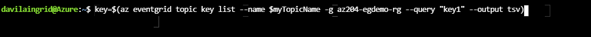

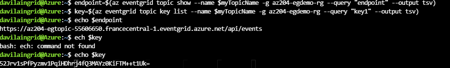

   

2. Create event data to send. Typically, an application or Azure service would send the event data, we're creating data for the purposes of the demo.

   

   ```
   event='[ {"id": "'"$RANDOM"'", "eventType": "recordInserted", "subject": "myapp/vehicles/motorcycles", "eventTime": "'`date +%Y-%m-%dT%H:%M:%S%z`'", "data":{ "make": "Contoso", "model": "Northwind"},"dataVersion": "1.0"} ]'
   ```

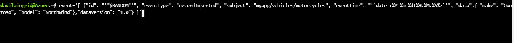


3. Use curl to send event to the topic.

   

   ```
   curl -X POST -H "aeg-sas-key: $key" -d "$event" $endpoint
   ```

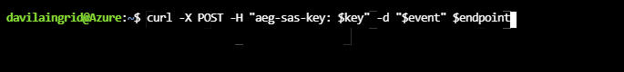

   

4. View your web app to see the event you just sent. Select the eye icon to expand the event data. Event Grid sends the validation event so the endpoint can verify that it wants to receive event data. The web app includes code to validate the subscription.

   

   ```
   {
   "id": "29078",
   "eventType": "recordInserted",
   "subject": "myapp/vehicles/motorcycles",
   "eventTime": "2019-12-02T22:23:03+00:00",
   "data": {
       "make": "Contoso",
       "model": "Northwind"
   },
   "dataVersion": "1.0",
   "metadataVersion": "1",
   "topic": "/subscriptions/{subscription-id}/resourceGroups/az204-egdemo-rg/providers/Microsoft.EventGrid/topics/az204-egtopic-589377852"
   }
   ```

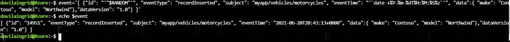

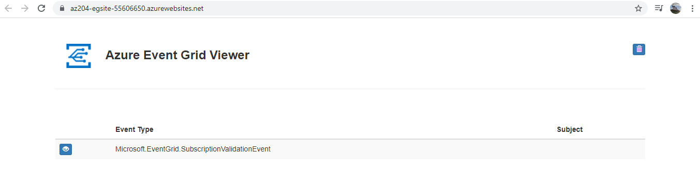

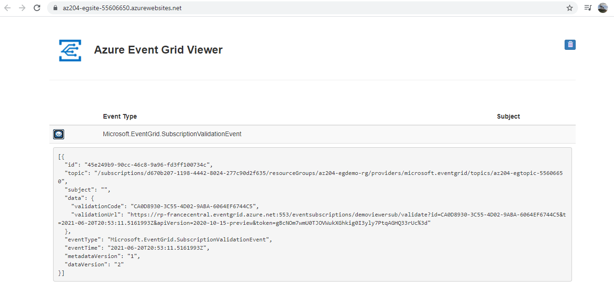

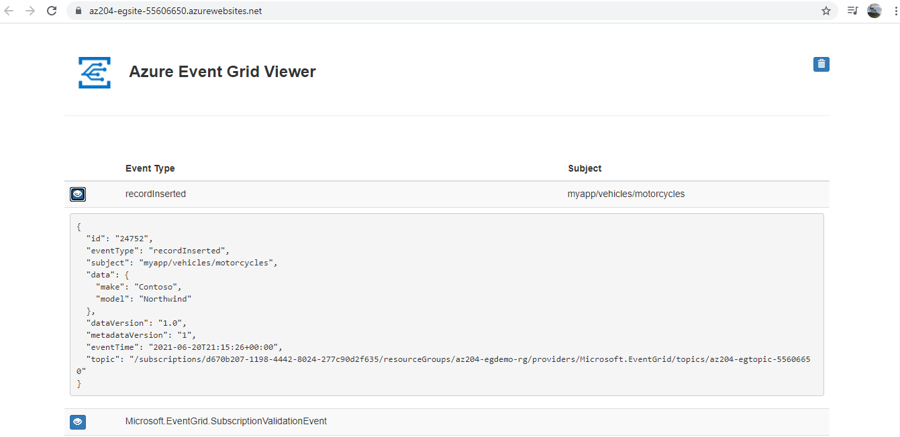

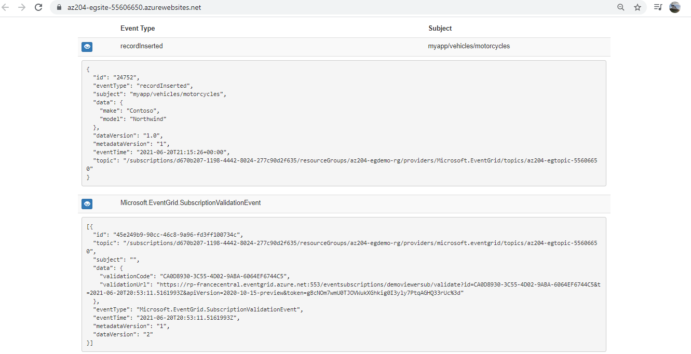

