# Lab 09: Publishing and subscribing to Event Grid events 

## Escenario de laboratorio
Your company builds a human resources (HR) system used by various customers around the world. While the system works fine today, your development managers have decided to begin re-architecting the solution by decoupling application components. This decision was driven by a desire to make any future development simpler through modularity. As the developer who manages component communication, you have decided to introduce Microsoft Azure Event Grid as your solution-wide messaging platform.

## Objetivos
After you complete this lab, you will be able to:

Create an Event Grid topic.

Use the Azure Event Grid viewer to subscribe to a topic and illustrate published messages.

Publish a message from a Microsoft .NET application.

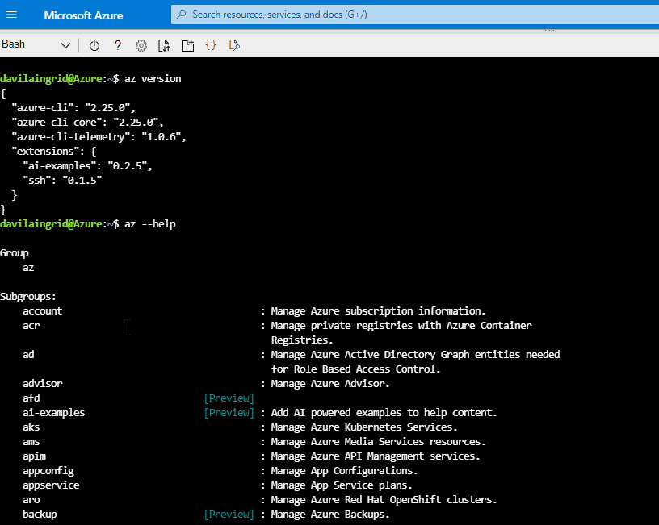

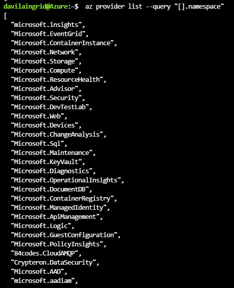

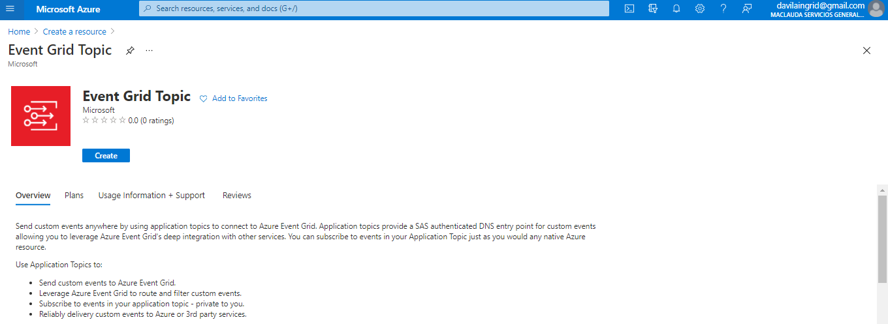

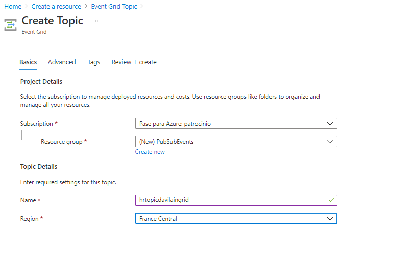

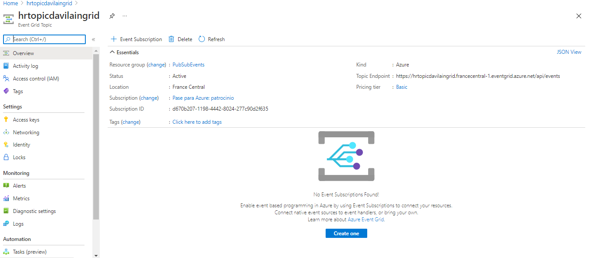

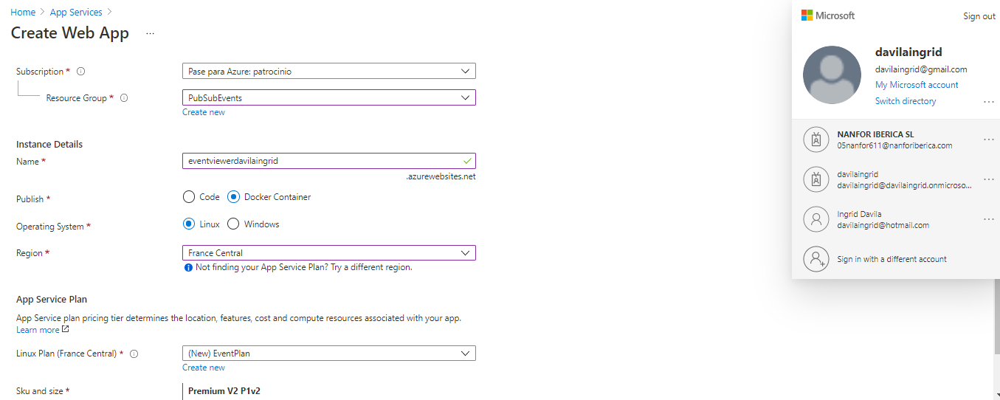

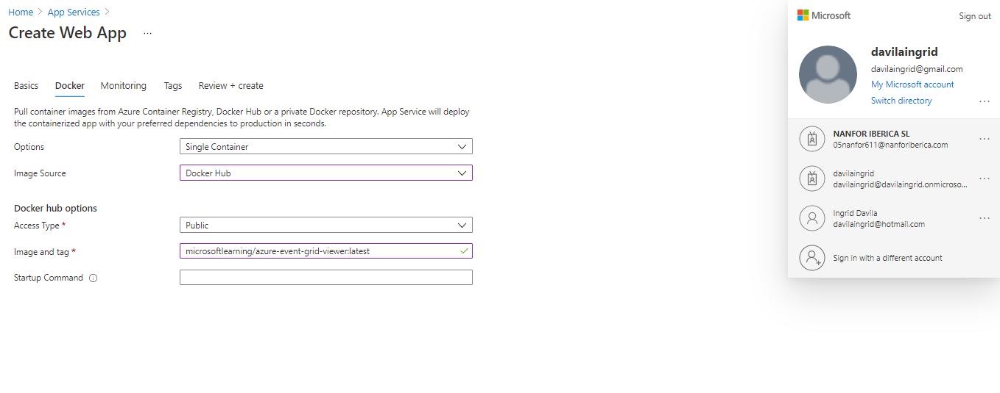

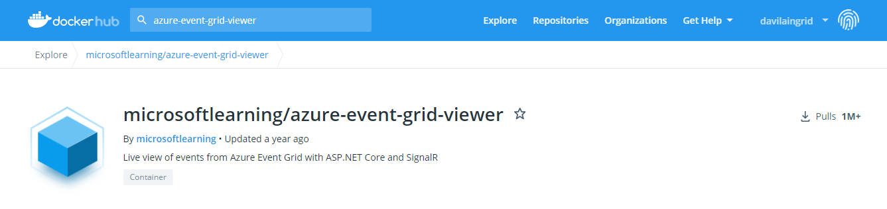

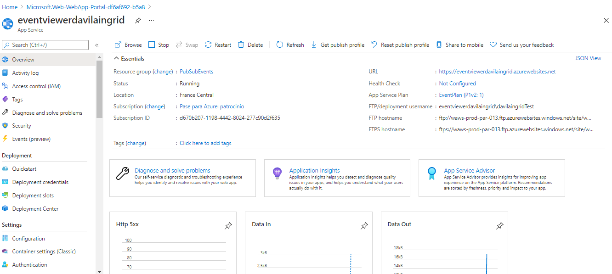

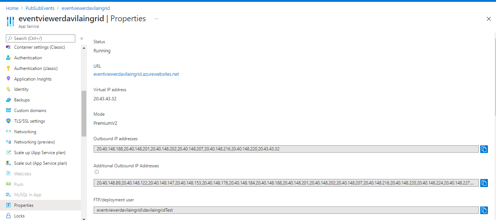

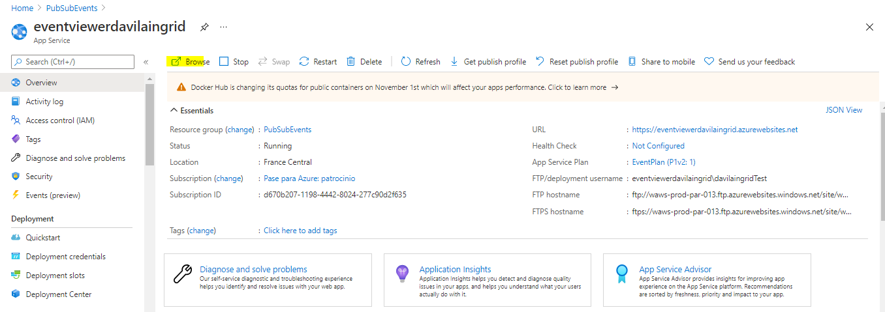

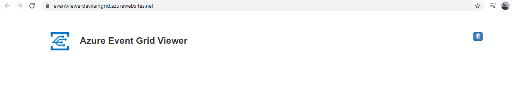

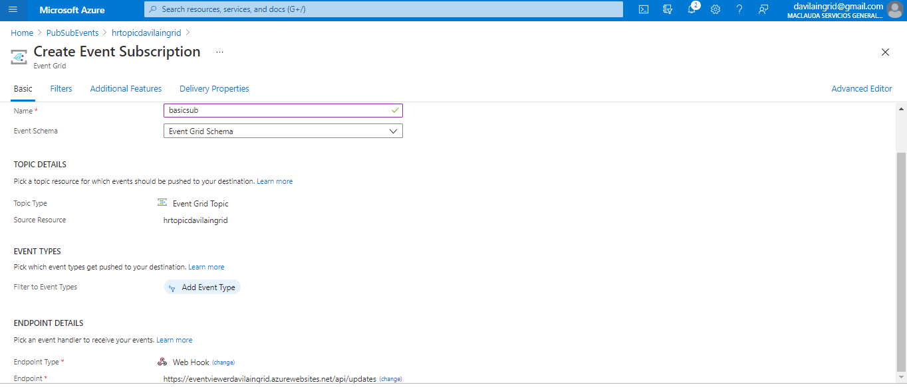

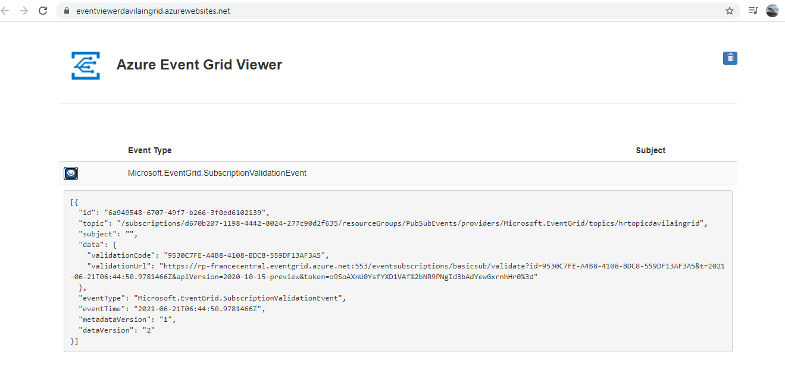

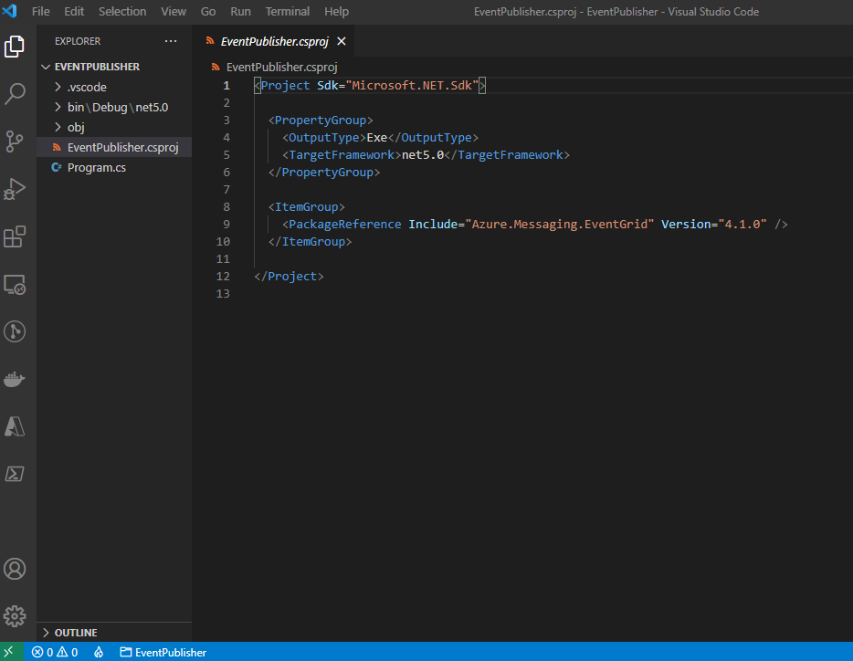

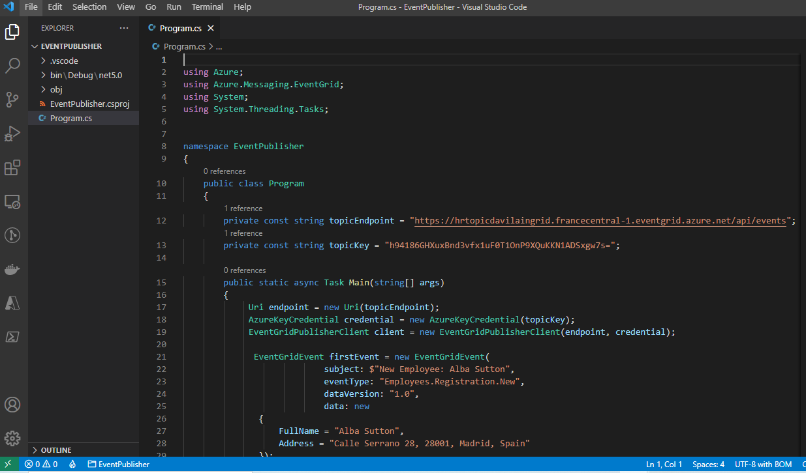

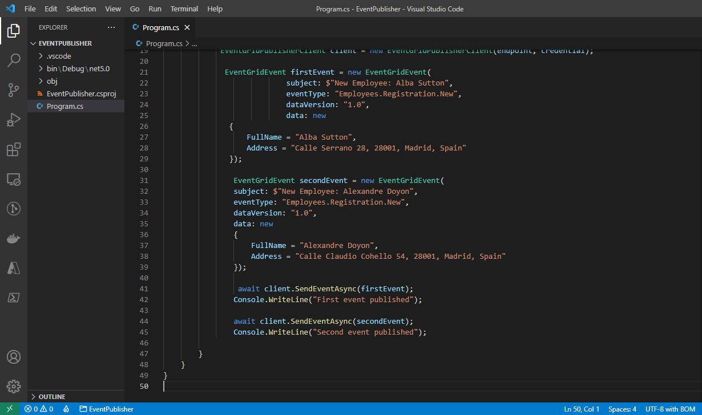

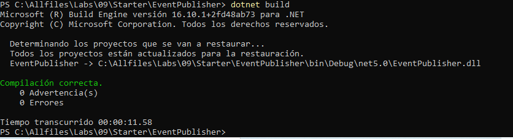

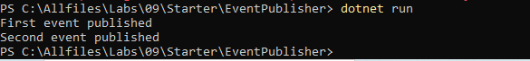

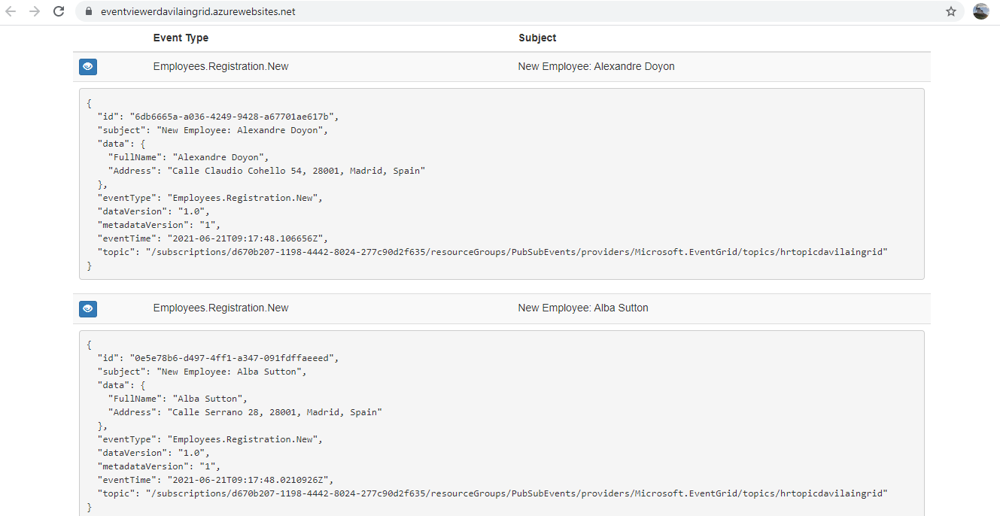

