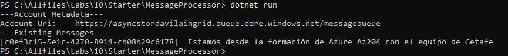

# Lab 10: Asynchronously processing messages by using Azure Storage Queues

## Escenario de laboratorio
You're studying various ways to communicate between isolated service components in Microsoft Azure, and you have decided to evaluate the Azure Storage service and its Queue service offering. As part of this evaluation, you'll build a prototype application in .NET that can send and receive messages so that you can measure the complexity involved in using this service. To help you with your evaluation, you've also decided to use Azure Storage Explorer as the queue message producer/consumer throughout your tests.

## Objetivos
After you complete this lab, you will be able to:

Add Azure.Storage libraries from NuGet.

Create a queue in .NET.

Produce a new message in the queue by using .NET.

Consume a message from the queue by using .NET.

Manage a queue by using Storage Explorer.

