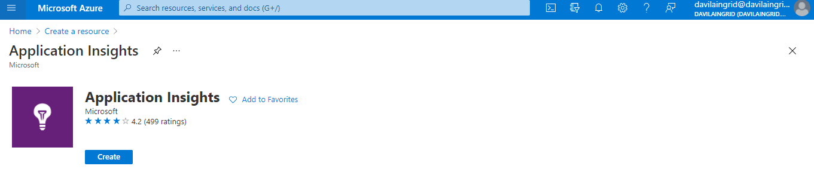
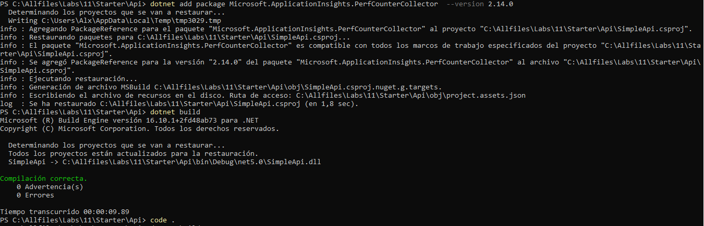
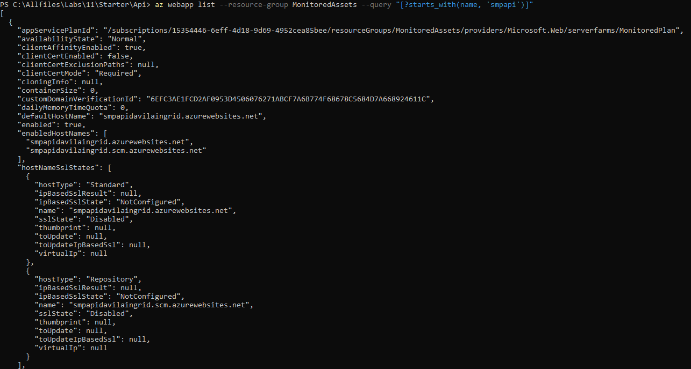

# Lab 11: Monitoring services that are deployed to Azure

## Escenario de laboratorio
You have created an API for your next big startup venture. Even though you want to get to market quickly, you have witnessed other ventures fail when they don’t plan for growth and have too few resources or too many users. To plan for this, you have decided to take advantage of the scale-out features of Microsoft Azure App Service, the telemetry features of Application Insights, and the performance-testing features of Azure DevOps.

## Objetivos

After you complete this lab, you will be able to:

Create an Application Insights resource.

Integrate Application Insights telemetry tracking into an ASP.NET web app and a resource built using the Web Apps feature of Azure App Service.

