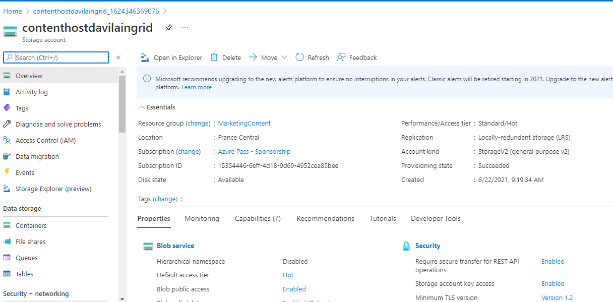
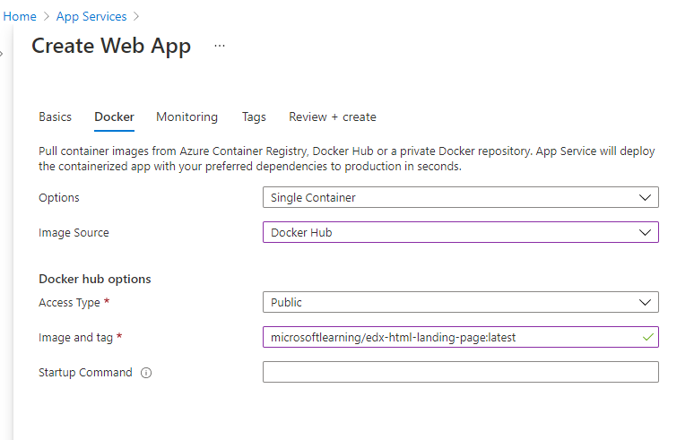

# Lab 12: Enhancing a web application by using the Azure Content Delivery Network

## Escenario de laboratorio
Your marketing organization has been tasked with building a website landing page to host content about an upcoming edX course. While designing the website, your team decided that multimedia videos and image content would be the ideal way to convey your marketing message. The website is already completed and available using a Docker container, and your team also decided that it would like to use a content delivery network (CDN) to improve the performance of the images, the videos, and the website itself. You have been tasked with using Microsoft Azure Content Delivery Network to improve the performance of both standard and streamed content on the website.

## Objetivos

After you complete this lab, you will be able to:

Register a Microsoft.CDN resource provider.

Create Content Delivery Network resources.

Create and configure Content Delivery Network endpoints that are bound to various Azure services.

